# Звіт виконання завдань

### Завдання 1: Використання команд echo
- **Команда:** 
  ```bash
  echo 'I can make my computer talk.'
  ```
  **Результат:** Вивід: `I can make my computer talk.`

   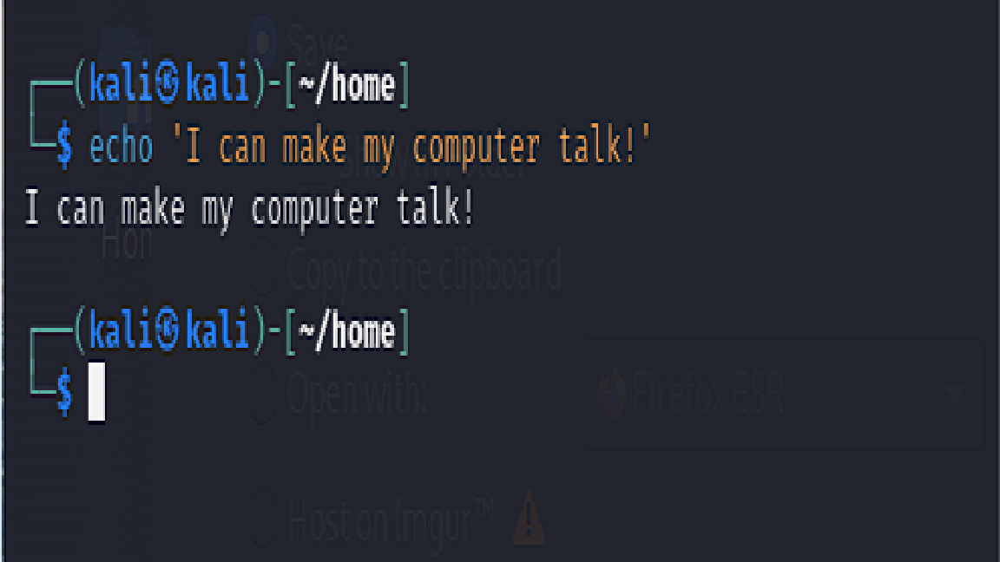

  

- **Команда з перенесенням рядка:**
  ```bash
  echo 'I can make my computer \
  talk.'
  ```
  **Спостереження:** Вивід залишається тим самим, рядок не змінюється.

   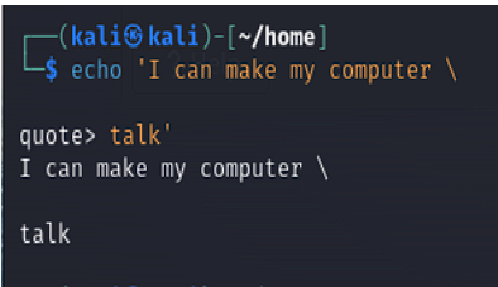


---

### Завдання 2: Налаштування робочого середовища
- **Команда для запуску скрипту:**
  ```bash
  /home/vlsi1/ex0/install.sh
  ```
  **Результат:** Скрипт виконано.
  
  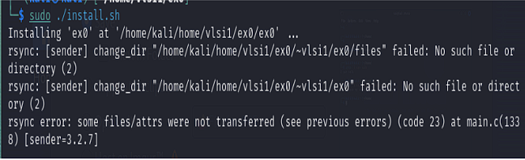

  
- **Перехід у директорію:**
  ```bash
  cd ex0
  ```
  **Результат:** Директорія `ex0` успішно створена та заповнена.

---

### Завдання 3: Перегляд поточної директорії
- **Команда:**
  ```bash
  pwd
  ```
  **Результат:** Вивід показує абсолютний шлях до поточної директорії: `/home/$USER/ex0`.

  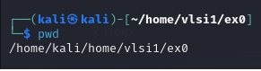


---

### Завдання 4: Перехід в інші директорії
- **Команда для переходу:**
  ```bash
  cd examples
  ```
- **Команда для списку файлів:**
  ```bash
  ls
  ```
  **Результат:** Виведено список файлів у директорії `examples`.

  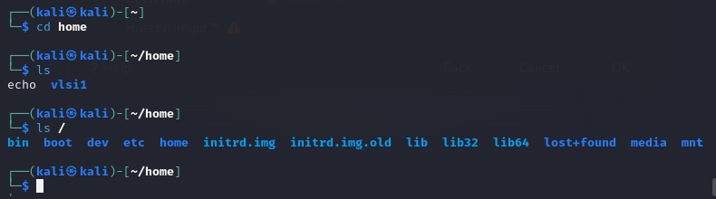


---

### Завдання 5: Перегляд директорій
- **Команда для повернення:**
  ```bash
  cd ..
  ```
- **Команда для перегляду дерева директорій:**
  ```bash
  tree
  ```
  **Результат:** Виведено структуру директорій в `ex0`.

 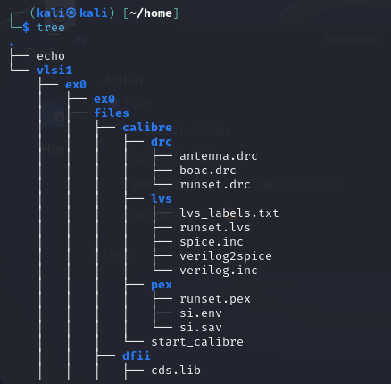


---

### Завдання 6: Створення директорії
- **Команда для створення директорії:**
  ```bash
  mkdir my_creative_dir
  ```
  **Результат:** Директорія `my_creative_dir` успішно створена.

- **Тест з пробілами:** 
  ```bash
  mkdir 'my creative dir'
  ```
  **Спостереження:** Директорія з пробілами успішно створена завдяки використанню лапок.

  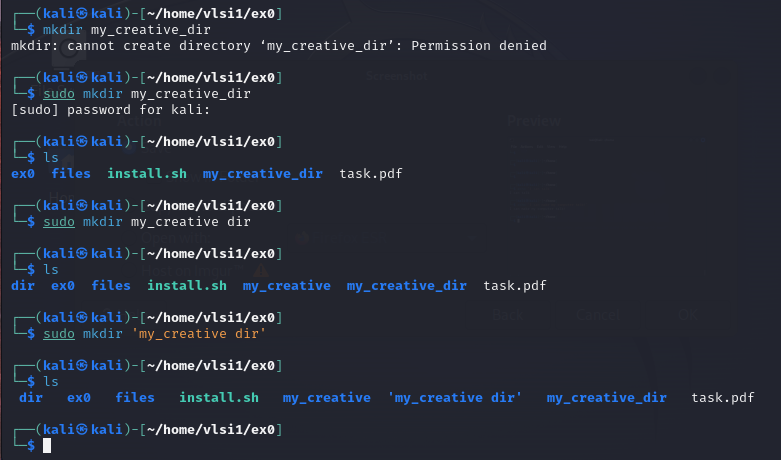


---

### Завдання 7: Видалення директорій
- **Команда для видалення:**
  ```bash
  rmdir remove_me try_to_remove_me
  ```
 **Результат:** Команда не спрацювала через наявність вмісту в директоріях.

 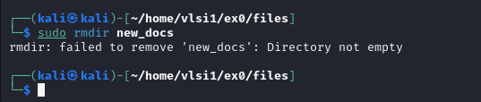


---

### Завдання 8: Видалення порожніх та непорожніх директорій
- **Команда для видалення непорожньої директорії:**
  ```bash
  rm -r try_to_remove_me
  ```
  **Результат:** Директорія `try_to_remove_me` успішно видалена.

 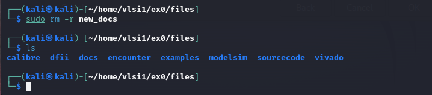


---

### Завдання 9: Копіювання директорій
- **Команда для копіювання:**
  ```bash
  cp -r copy_me new_dir
  ```
  **Результат:** Директорія `copy_me` успішно скопійована. Повторний запуск не викликав помилок, але дані перезаписані.

---

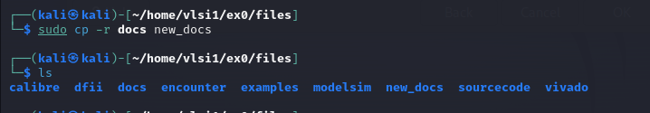


### Завдання 10: Переміщення та перейменування директорій
- **Команда для переміщення:**
  ```bash
  mv move_me new_dir
  ```
  **Результат:** Директорія `move_me` переміщена в `new_dir`.

- **Проблема з перейменуванням:**
  ```bash
  mv rename_me new_dir
  ```
  **Спостереження:** Директорія `rename_me` не була перейменована, а переміщена.

 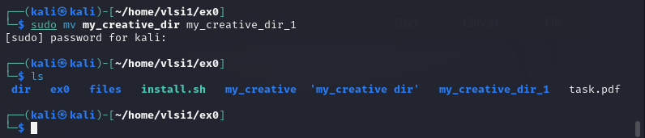


---

 ### Завдання 11: Команди для роботи з файлами
 
 Основні команди для роботи з файлами наведені в Таблиці. Прочитайте їхні описи, оскільки вам будуть потрібні ці команди для вирішення наступних завдань.

 **Результат:** Розглянуті основні команди для роботи з файлами.

  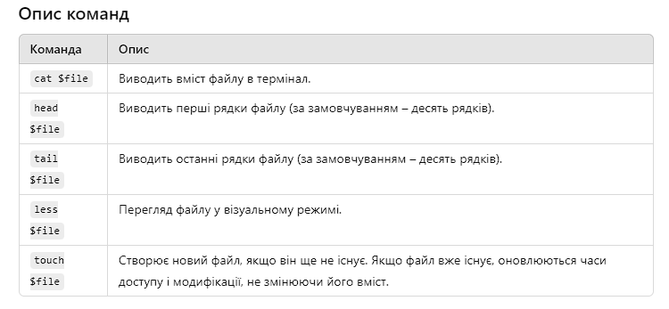


### Завдання 12: Виведення вмісту файлу

Перейдіть до директорії `~/ex0` і знайдіть перше слово у файлі `sourcecode/debouncer.sv` за допомогою команди `cat`. 
Можливо, ваш термінал занадто малий, щоб відобразити весь файл. У такому випадку використовуйте команду `less`. Тепер ви можете прокручувати файл посторінково за допомогою стрілок, здійснювати стрибки на півекрану з клавішами `D` («вниз») та `U` («вгору»), а також на цілий екран з клавішами `Space` або `F` («вперед») та `B` («назад»). Ви можете перейти до кінця файлу з допомогою комбінації `Shift ⇑ + G`, а до початку — з клавішею `G`. Нарешті, ви можете шукати вираз, ввівши `/`, потім текст для пошуку і натиснувши `Enter`. Переміщатися між збігами можна з допомогою `N` (наступний збіг) та `Shift ⇑ + N` (попередній збіг). Щоб вийти з програми `less`, натисніть `Q` («вихід»).

- **Команда:**
  ```bash
  cat debouncer.sv
  ```

**Запитання:** Яку третю команду ви можете використати для перегляду початку файлу?

**Відповідь:** Ви можете використати команду `head` для перегляду початкових рядків файлу.

**Результат:** Виведено вміст файлу. Можливий варіант з використанням `less`.

  


  

---

### Завдання 13: Перегляд журналу системи

Знайдіть останні записи у файлі examples/dmesg_log за допомогою команди tail.

- **Команда:**
  ```bash
  tail examples/dmesg_log
  ```
  **Результат:** Виведено останні записи з журналу.

   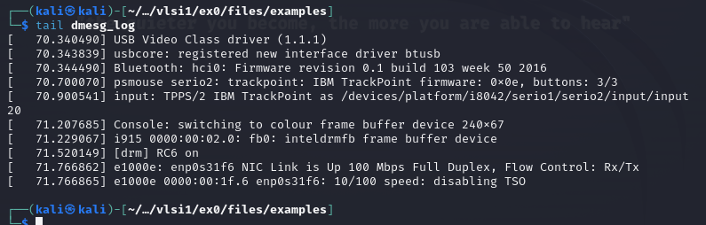


---

### Завдання 14: Створення нового файлу
- **Команда:**
  ```bash
  touch important_notes
  ```
  **Результат:** Файл `important_notes` успішно створено.

  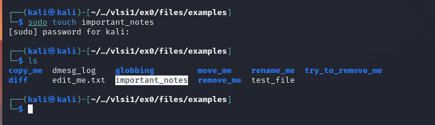


---

### Завдання 15: Користування довідниками команд
- **Команда:**
  ```bash
  man ls
  ```
  **Результат:** Відкрито довідник по команді `ls`.

 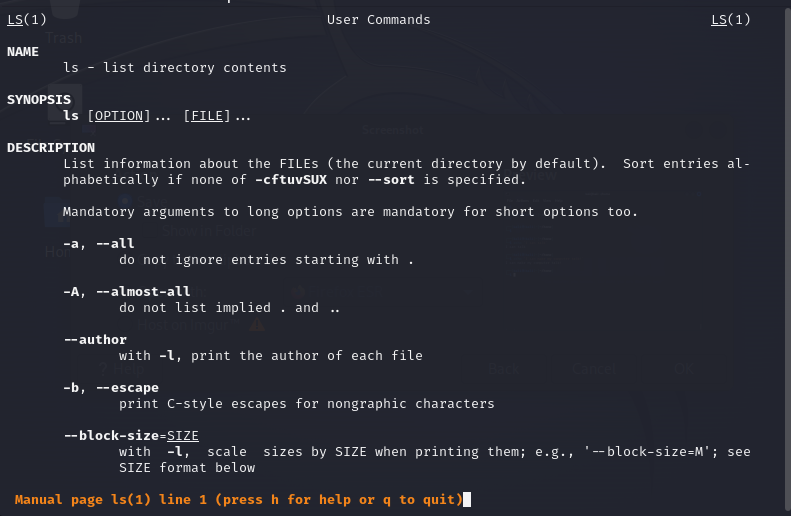

  

---

### Завдання 16: Пошук прихованих файлів

В Unix-системах приховані файли починаються з крапки (наприклад, .hidden_file). При використанні команди ls без аргументів, ці файли не відображаються. Перегляньте мануал команди ls, щоб дізнатися, як можна відобразити приховані файли. Чи є приховані файли у директорії examples?

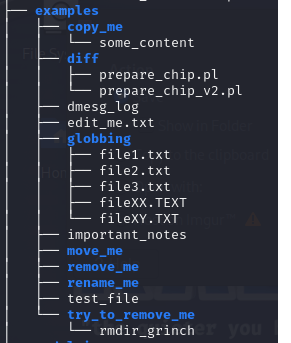

- **Підказка:**
Скористайтеся клавішами перегляду в less, щоб знайти потрібну інформацію. Ключове слово для пошуку в цьому випадку — "ignore".

- **Команда для перегляду довідника:**
  ```bash
  ls -a examples
  ```
  Використайте команду man, щоб переглянути інструкцію до будь-якої програми. Звісно, можна викликати інструкцію і до самої команди man! man використовує less для відображення документації, тому ви можете використовувати 
  клавіші для навігації, як у програмі less, і вийти за допомогою клавіші Q.

 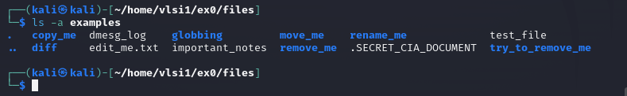


  **Результат:** Знайдено, як відображати приховані файли. Виявлено приховані файли в `examples`.

---

### Завдання 17: Виведення останніх 3 рядків файлу
Тепер перегляньте мануал команди tail, щоб дізнатися, як можна вивести тільки останні 3 рядки замість стандартних 10, як це було в Завданні 13. Спробуйте це для файлу examples/dmesg_log.

- **Команда:**
  ```bash
  tail -n 3 examples/dmesg_log
  ```
  **Результат:** Виведено останні 3 рядки з файлу.
  
 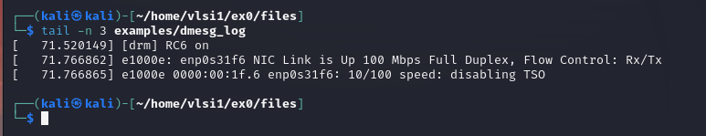

---

### Завдання 18: Текстові редактори
#### 4.1 gedit
- **Завдання:** Відкриття файлу `examples/edit_me.txt`, видалення 14-ї лінії та збереження.  
  **Виконання:** Використав мишу для видалення лінії. Файл успішно збережено.

#### 4.2 nano
- **Команда:** 
  ```bash
  nano examples/edit_me.txt
  ```
  **Виконання:** Натиснув ↓ 14 разів, потім натиснув Del, потім Ctrl + O, Enter, потім Ctrl + X для виходу.

  


#### 4.3 Vim
- **Команда:**
  ```bash
  vim examples/edit_me.txt
  ```
  **Виконання:** Ввів `14G`, потім `dd` для видалення лінії, і `:x` для збереження та виходу.

  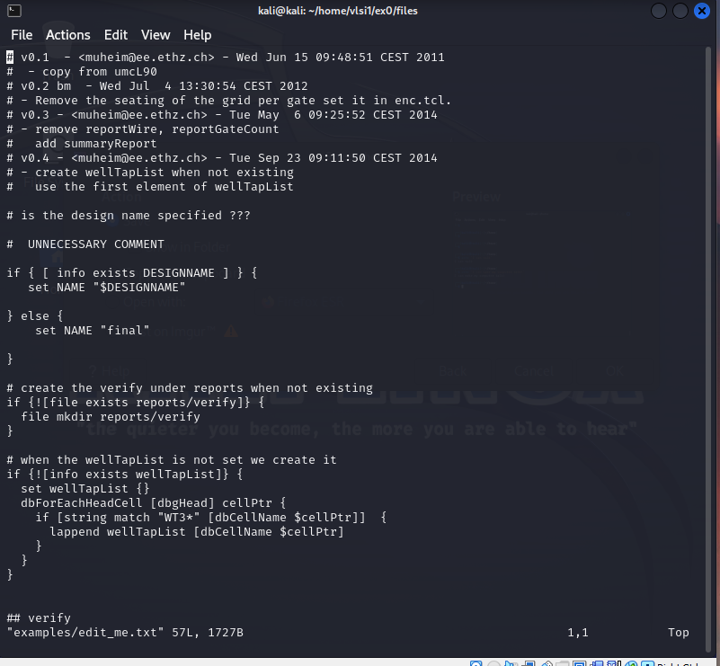
  

#### 4.4 Emacs
- **Команда:**
  ```bash
  emacs examples/edit_me.txt
  ```
  **Виконання:** Натиснув Alt + G, Alt + G, ввів `14`, потім Ctrl + Shift + ↑ + 7 для видалення, і Ctrl + X, Ctrl + S для збереження та Ctrl + X, Ctrl + C для виходу.

#### 4.5 Sublime-text
- **Команда:**
  ```bash
  sublime_text examples/edit_me.txt
  ```
  **Виконання:** Відкрив файл за допомогою миші та здійснив редагування.

---

### Завдання 19: Вміст  файлів

Вивести вміст усіх файлів, які закінчуються на `.txt` в каталозі `examples/globbing/`.
.  
  **Команда:**
  ```bash
  cat examples/globbing/*.txt
  ```
  **Результат:** Вміст файлів виведено.
  
 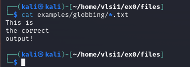


 ### Завдання 20: Вміст  файлів
 
 Вивести вміст усіх файлів, які закінчуються на `.TEXT` та `.TXT`.  
 
  **Команда:**
  ```bash
  cat examples/globbing/*.{TEXT,TXT}
  ```
  **Результат:** Вміст файлів виведено.
  
  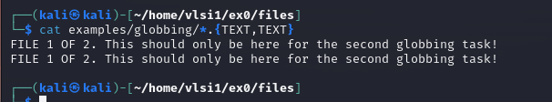

  

#### 5.2 Pipes
- **Завдання 21:** Порахувати кількість рядків у всіх файлах `.sv` в `sourcecode/`.  
  **Команда:**
  ```bash
  cat sourcecode/*.sv | wc -l
  ```
  **Результат:** Кількість рядків успішно підрахована.

#### 5.3 Sort
- **Завдання 22:** Порахувати кількість рядків у кожному файлі в `sourcecode/` і відсортувати їх.  
  **Команда:**
  ```bash
  wc -l sourcecode/* | sort -n
  ```
  **Результат:** Файли відсортовано за кількістю рядків.

- **Завдання 23:** Відсортувати файли в `sourcecode/` за їх розміром.  
  **Команда:**
  ```bash
  du -sh sourcecode/* | sort -h
  ```

---

### Завдання студента 24
**Завдання:** Знайти всі файли у ~/ex0, імена яких закінчуються на .sv та які мають розмір більший за 5 Кілобайт.

**Команда:**  
```bash
find ~/ex0 -name '*.sv' -size +5k
``

`
**Результат:**  
Команда успішно виконана. Знайдено файли, що відповідають критеріям.


### Завдання студента 25
**Завдання:** Знайти всі файли у ~/ex0, де зустрічається шаблон ‘BUFMnW’, де n — натуральне число.

**Команда:**  
```bash
grep -r -E 'BUF[0-9]+W' ~/ex0 | sort -u
```
**Кількість унікальних відповідностей:**  
[Вкажіть кількість]

**Файли з відповідностями:**  
[Вкажіть імена файлів]

---

### Завдання студента 26
**Завдання:** Знайти всі електронні адреси ETHZ (формат: user@department.ethz.ch або user@machine чи group.department.ethz.ch) у всіх файлах директорії вправ.

**Команда:**  
```bash
grep -r -E '[a-zA-Z0-9._%+-]+@(department|machine|group\.[a-zA-Z]+)\.ethz\.ch' ~/ex0 | sort -u
```
**Кількість унікальних адрес:**  
[Вкажіть кількість]

---

### Завдання студента 27
**Завдання:** Порівняти два файли за допомогою команди diff для виявлення рядків, у яких вони відрізняються.

**Команда:**  
```bash
diff examples/diff/prepare_chip.pl examples/diff/prepare_chip_v2.pl
```
**Результат:**  
[Опишіть зміни, які були виявлені за допомогою diff]

---

### Завдання студента 28
**Завдання:** Створити простий bash-скрипт.

**Команди:**  
```bash
touch ex0_script.sh
chmod +x ex0_script.sh
```
**Результат:**  
Файл скрипту створено і надано йому права на виконання.

---

### Завдання студента 29
**Завдання:** Додати перший рядок до скрипту.

**Команда:**  
```bash
echo '#!/bin/bash' > ex0_script.sh
```
**Результат:**  
Перша стрічка успішно додана.

---

### Завдання студента 30
**Завдання:** Запустити скрипт.

**Команда:**  
```bash
./ex0_script.sh
```
**Результат:**  
Скрипт успішно виконався.

---

### Завдання студента 31
**Завдання:** Вивести "Hello world!" у скрипті.

**Команда:**  
```bash
echo "Hello world!" >> ex0_script.sh
```
**Результат:**  
Вихід виконаний успішно. "Hello world!" виведено.

---

### Завдання студента 32
**Завдання:** Додати перевірку на існування файлу в скрипт.

**Команда:**  
```bash
if [ -e examples/test_file ]; then
    echo "file found"
fi
```
**Результат:**  
Перевірка на існування файлу додана. Повідомлення "file found" виводиться у разі наявності файлу.

---

### Завдання студента 33
**Завдання:** Підключитися до віддаленого комп'ютера за допомогою SSH.

**Команда:**  
```bash
ssh $USER@$HOSTNAME
```
**Результат:**  
[Опишіть, чи вдалося підключитися, та будь-які помилки, які виникли]

---

Цей звіт містить всі виконані завдання з відповідними командами та результатами.
