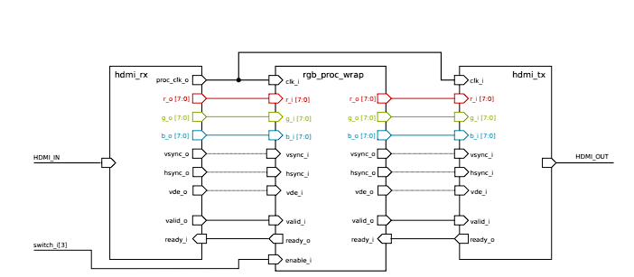
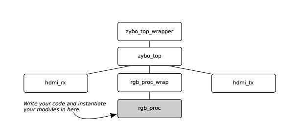
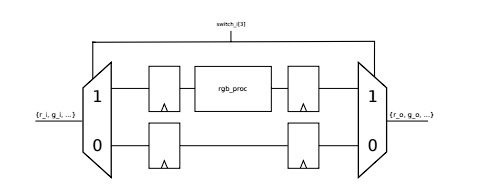
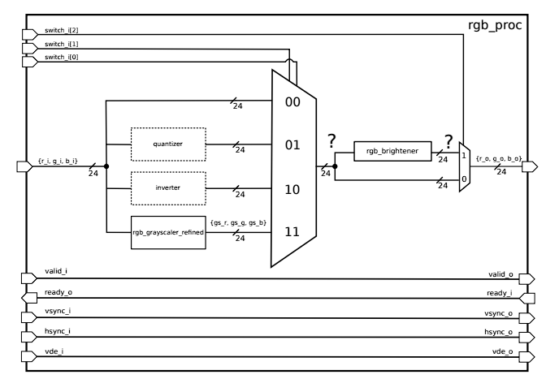

### Кодування на HDL: Комбінаторні схеми
**Проф. Л. Беніні, Ф. Гюркаянк, М. Корб**  
**Остання зміна:** 2024-09-17 10:30:19 +0200

#### Нагадування:
Починаючи це навчання, ви підтверджуєте, що розумієте та приймаєте правила використання установок CAE/CAD програмного забезпечення в ETH Zurich. З ними можна ознайомитись у будь-який час на [eda.ee.ethz.ch](http://eda.ee.ethz.ch/index.php/Regulations).

### 1 Вступ
У цій вправі ви будете використовувати основні концепції мови опису апаратного забезпечення SystemVerilog (HDL) для чисто комбінаторних схем. Зокрема, ви дізнаєтеся:
- як описувати логічні функції, такі як AND та OR,
- як працювати з типами даних у SystemVerilog,
- як реалізовувати комбінаторні блоки, наприклад мультиплексор,
- як створювати ієрархічні архітектури з допомогою модулів, і
- як реалізовувати прості арифметичні функції, такі як множення і додавання.

Вправа розрахована на виконання протягом двох післяобідніх сесій. Разом ми реалізуємо відеопроцесор реального часу HDMI на вашій платі Zybo Z7. Ми припускаємо, що ви вже знайомі з процесом проектування і реалізації FPGA, але може бути корисно ознайомитися з аркушем вправи 1. Під час виконання вправи ви також познайомитеся з симулятором Vivado, який можна використовувати для функціональної перевірки. Ви використовуватимете його з наданим тестовим стендом (розробка власного тестового стенду буде темою вправи 4, і ми не очікуємо, що ви повністю вивчите симулятор після цієї вправи).

Як завжди, ми заохочуємо вас обговорювати будь-які питання, що виникають під час виконання вправи, з асистентами.

### 2 Підготовка
Завдання для студента 1 (налаштування): Налаштуйте робочу директорію для цієї вправи, запустивши наш інсталяційний скрипт і перейшовши в новостворену директорію:
```sh
sh > /home/vlsi1/ex2/install.sh
sh > cd ex2
```

### 3 Обробка відео
Перед тим як розпочати реалізацію вашого відеопроцесора, ми надамо вам деякі базові знання з обробки відео. Зокрема, ми коротко пройдемося по основах кольорової моделі червоний-зелений-синій (RGB) та інтерфейсу HDMI. Насамперед важливо зазначити, що відео — це просто послідовність зображень (у контексті обробки відео ці зображення називаються кадрами), а зображення — це просто масив пікселів.

#### 3.1 RGB
Піксель — це найменша адресована точка в растровому зображенні і, для моделі RGB, складається з трьох компонентів (які ще називаються каналами), інтенсивність яких може змінюватися. Чим більше у вас пікселів, тим вища роздільна здатність зображення. RGB — це проста та поширена адитивна кольорова модель: адитивна означає, що канали (червоний, зелений і синій у даному випадку) додаються для зображення кольору пікселя.



### 3.1.1 Глибина кольору
Як і щільність пікселів, глибина кольору є мірою якості зображення. Вона визначає, скільки різних кольорів може бути представлено одним пікселем. Як вже було зазначено, кожен із трьох компонентів пікселя має свою інтенсивність; у цій вправі ми будемо безпосередньо взаємодіяти з ними: кожен канал RGB має 8 біт, отже доступно 256 різних інтенсивностей для кожного з трьох кольорів, які варіюються від 0 (відсутність цього кольору) до 255 (максимальна інтенсивність цього кольору). Завдяки комбінації трьох кольорів ми здатні відтворити \( 2^8 \times 2^8 \times 2^8 = 16,777,216 \) різних кольорів. 

Тож чорний піксель у моделі RGB буде представлений значеннями:

$$
\text{rgb}_{\text{black}} = (0, 0, 0)
$$

де всі канали мають інтенсивність 0. Навпаки, білий піксель буде мати максимальні значення на кожному каналі:

$$
\text{rgb}_{\text{white}} = (255, 255, 255)
$$

а, наприклад, чисто червоний піксель матиме:

$$
\text{rgb}_{\text{red}} = (255, 0, 0)
$$

### 3.2 HDMI
Інтерфейс HDMI (High Definition Multimedia Interface) був представлений у 2002 році для цифрової передачі аудіо- та відеосигналів і з того часу зазнав подальшого розвитку. Він є зворотно сумісним з інтерфейсом DVI (Digital Video Interface) за допомогою простого пасивного адаптера. Хоча інтерфейс пропонує багато режимів та каналів зв'язку, для наших цілей його функціонування можна зрозуміти досить просто.

На Рис. 1 зображені всі сигнали, які потрібно врахувати при реалізації вашої схеми. Найважливішими є дроти RGB, які визначають колір пікселя, як описано раніше. Три сигнали – `hsync`, `vsync` і `vde` – використовуються приймачем (наприклад, дисплеєм) для синхронізації горизонтального та вертикального положення пікселя. У цьому завданні ми просто будемо передавати ці сигнали через процесор і не працюватимемо з ними, хоча дуже важливо забезпечити їхню точну синхронізацію з сигналами RGB.

Сигнали `ready` та `valid` використовуються для узгодженої передачі даних між модулями: приймач пакета даних сигналізує передавачу, що він готовий прийняти новий пакет, через сигнал `ready`, а передавач вказує приймачу наявність нових даних через сигнал `valid`.

### 4. SystemVerilog
Маючи знання з лекції 3, ви повинні бути в змозі написати весь вихідний код для цього завдання. Хороший огляд найважливіших концепцій можна знайти на сторінці Wiki інституту IIS[^1]. Для кращого розуміння також зверніться до розділу 4.3 підручника "Top-Down Digital VLSI Design" від професора Каесліна.

#### 4.1 Рекомендації щодо написання коду
Використання спільних правил для іменування та стилю кодування створює можливість працювати над проєктами інтегральних схем (IC) у всьому світі. Ми настійно рекомендуємо дотримуватися цих правил для будь-якого проєкту, над яким ви працюєте. Ви можете знайти рекомендації, які використовуються в нашому інституті, за посиланням: [https://github.com/lowRISC/style-guides/blob/master/VerilogCodingStyle.md](https://github.com/lowRISC/style-guides/blob/master/VerilogCodingStyle.md).

#### 4.2 Підтримка SystemVerilog у текстових редакторах
Загалом ми не вимагаємо використовувати конкретний текстовий редактор для виконання завдань, проте робота стане значно простішою, якщо використовувати редактор, який підтримує синтаксис SystemVerilog. Хоча ви можете бути знайомі із сучасними інтегрованими середовищами розробки (IDE), сумною правдою є те, що на сьогодні немає IDE (принаймні за знанням авторів), яка б забезпечувала достатню підтримку для розробки на SystemVerilog. Оскільки розробники мов опису апаратного забезпечення (HDL) працюють із безліччю скриптових мов і текстових файлів, потужний багатофункціональний текстовий редактор є оптимальним вибором. Хоча більш потужні редактори, такі як `vim`, `Emacs`, є менш зручними для новачків у порівнянні з `Gedit` або `Notepad++`, вони можуть значно підвищити ефективність роботи після набуття певних навичок. Вивчення принаймні одного текстового редактора з керуванням з клавіатури — це добре проведений час для кожного інженера.

##### 4.2.1 Emacs
В інституті IIS ми підтримуємо налаштування для текстового редактора Emacs, що є безкоштовним і з відкритим кодом, яке містить усі необхідні компоненти. Це налаштування включає додаткові пакети для автоматичної перевірки синтаксису, сучасний графічний інтерфейс і деякі більш дружні до початківців стандартні параметри. Це дає змогу відразу почати користуватися редактором, не заглиблюючись у складну систему налаштувань оригінальної версії Emacs. Ви можете встановити ці налаштування, виконавши таку команду в терміналі:

```
sh > /home/vlsi1/emacs-systemverilog/install.sh
```

Встановлення може тривати кілька хвилин. Під час завершення процесу Emacs запуститься в терміналі для виконання ініціалізаційних скриптів. Дочекайтеся, доки Emacs самостійно завершить роботу! Ігноруйте можливі попередження на кшталт `Error while dumping Spacemacs` і просто дочекайтеся, поки Emacs закриється самостійно. Встановлення буде завершено, коли в терміналі з’явиться повідомлення `All done`. Після завершення процедури встановлення обов’язково відкрийте новий термінал і виконайте:

```
sh > emacs <some-file-to-open>
```

Якщо все пройшло успішно, ви побачите інструкцію з використання налаштованої версії Emacs. Якщо ви загубилися в інтерфейсі `Spacemacs`, ви завжди можете знайти посібник із швидкого старту та шпаргалку в меню `IIS Students` у верхньому лівому куті.

> Примітка: Набір налаштувань для студентів і процедура встановлення є відносно новими. Будемо вдячні за будь-які відгуки про помилки, виявлені під час встановлення, та зручність використання.

[^1]: [SystemVerilog Example на Wiki](http://eda.ee.ethz.ch/index.php?title=SystemVerilog_Example).



#### Рисунок 2: Огляд ієрархії блоків, що використовуються для обробки відео в цих завданнях

#### 4.2.2 Sublime Text
Якщо ви вже використовуєте Sublime Text — комерційний багатофункціональний текстовий редактор — ми рекомендуємо встановити плагін SystemVerilog для Sublime Text. Удома можна встановити його як звичайний пакет через PackageControl. Тут, у лабораторії, потрібно вручну скопіювати його через Git:

```sh
sh > cd ~/.config/sublime-text/Packages
sh > git clone https://github.com/TheClams/SystemVerilog
sh > cd ~/ex2/
```

Після цього можна запустити Sublime Text, ввівши таку команду в терміналі:

```sh
sh > sublime_text
```

**Завдання для студента 2 (Налаштування редактора):**
- Виберіть один із зазначених вище редакторів, встановіть налаштування для SystemVerilog і ознайомтесь з його інтерфейсом.
- Відкрийте один із файлів SystemVerilog у папці `part1/sourcecode` і переконайтесь, що редактор виділяє синтаксис HDL-коду.

### 5. Ознайомлення з проєктом
На попередньому занятті ви навчились створювати новий проєкт у Vivado. Ми зазначали, що гарною практикою є створення скрипта для прискорення ініціалізації нового проєкту. Цього разу ми вже підготували необхідні скрипти для вас. Ці скрипти створять новий проєкт під назвою `ex2-part1` і імпортують усі вже створені вихідні дані. Вони також встановлять зв'язки між модулями для створення повноцінної функціональної схеми.

**Завдання для студента 3 (Налаштування проєкту):** Перейдіть до папки `part1/vivado` і виконайте `Makefile`:

```sh
sh > cd part1/vivado
sh > make
```

Через кілька секунд ви побачите блокову схему відеопроцесора з трьома основними модулями, як показано на Рисунку 1. Якщо натиснути на вкладку `Sources` у середньому стовпці екрана, ви зможете перейти до різних вихідних файлів. Ви побачите, що структура ієрархічна, як і на Рисунку 2.



Рис 3: Схема буферизації та функції обходу в rgb_proc_wrap.]

Під час цього завдання вам не потрібно звертати увагу на модулі `hdmi_rx`, `hdmi_tx` та `zybo_top`. Вони використовуються для роботи з фізичними інтерфейсами HDMI і для зручного відображення HDMI-сигналу у форматі, що легко модифікується.

Може здатися дивним, що для архітектури, яка складається лише з трьох модулів (як показано на Рисунку 1), використовується так багато файлів. Однак більшість із них застосовуються всередині модуля `rgb_proc_wrap`. `rgb_proc_wrap` є обгорткою навколо основного модуля обробки RGB, `rgb_proc`, який ви створите. Обгортка (wrapper) можна вважати модулем, що робить внутрішній модуль сумісним із навколишньою схемою, але не додає додаткового функціоналу. `rgb_proc_wrap` виконує три завдання:

1. Забезпечує два незалежні шляхи сигналу: один через `rgb_proc`, а інший обходить його. Як показано на Рисунку 3, обхід контролюється вхідним сигналом `enable_i`, який підключений до перемикача 3 (лівий перемикач на платі). Тобто, для тестування `rgb_proc` вам потрібно ввімкнути перемикач 3; якщо ваш модуль спотворює вихідний сигнал, ви завжди можете обійти його, вимкнувши перемикач 3. Таким чином, у більшості випадків вам не доведеться відключати FPGA від монітора, якщо вихідні дані пошкоджені.

2. Буферизує всі сигнали, що надходять від `hdmi_rx` до `hdmi_tx`, щоб `rgb_proc` був послідовно розділений, і у вас був повний тактовий цикл для найтривалішого шляху (ви дізнаєтесь більше про таймінги та найдовші шляхи в Завданні 3).

3. Це модуль Verilog, який всередині викликає SystemVerilog-модуль `rgb_proc`, оскільки Vivado не може безпосередньо викликати модулі SystemVerilog у блок-схемах.

Тепер розглянемо функціональність модуля `rgb_proc`.

### Завдання для студентів: програмування FPGA і підключення HDMI для відеопроцесора

1. **Завдання 4 (Реверс-інжиніринг)**:
   - Відкрийте вихідний код модулів `rgb_proc` і `rgb_grayscaler_primitive` у текстовому редакторі або перегляньте їх безпосередньо в Vivado.
   - Проаналізуйте код і створіть схему, що відображає їхню об'єднану функціональність (тільки основні сигнали).
   - Опишіть функціональність, яку реалізують ці модулі. Щоб перевірити правильність опису, далі виконайте програмування FPGA.

2. **Завдання 5 (Генерація бітстріму та програмування FPGA)**:
   - Запустіть синтез коду, що займе приблизно 2 хвилини. Під час синтезу можна під'єднати плату FPGA до ПК за допомогою USB-кабелю і увімкнути живлення. Перевірте, що ви під'єднали плату до правильного USB-порту, і переконайтеся, що перемикачі розташовані відповідно до попереднього завдання.
   - Запустіть процес реалізації, який також триватиме до 2 хвилин.
   - Згенеруйте бітстрім і завантажте його в плату.

3. **Завдання 6 (Підключення FPGA між ПК та дисплеєм)**:
   - Від'єднайте DVI-кабель між ПК і монітором з обох сторін.
   - Підключіть HDMI-кабель між інтерфейсом дисплея ПК та HDMI RX на платі FPGA.
   - Підключіть інший HDMI-кабель від HDMI TX на платі FPGA до HDMI або DVI порту дисплея.
   
   *Підказка:* Разом із платою FPGA повинні були надати або два HDMI-DVI кабелі, або один HDMI-HDMI і один HDMI-DVI. Якщо випадково у вас обидва HDMI-HDMI, зверніться до асистента для обміну кабелю.

   Тепер на дисплеї має з'явитися зображення, як раніше, хоча з невеликою зміною роздільної здатності. Плата Zybo обробляє дані із трохи вищою роздільністю, що може викликати попередження про зміну роздільної здатності, яке можна ігнорувати. Якщо зображення не відображається правильно, зверніться до асистента.


### 5.1 Дослідження функціональності

**Завдання 7 (Дослідження функціональності):**
- Перемикайте SW0 та SW3. Перевірте, коли режим сірого кольору активується.

### 5.2 Удосконалення функціональності

Поточне рішення для перетворення кольорового зображення в сірий є досить простим, і його можна вдосконалити. Дослідження показують, що людське око краще сприймає сірий колір, якщо він формується з усіх трьох каналів (червоного, зеленого та синього) із різними вагами, які трохи змінюють яскравість. Пропонуємо використати наступні ваги для кожного каналу:

| Канал | Вага         | Трансформована вага |
|-------|--------------|---------------------|
| червоний | 0.30         |                   |
| зелений  | 0.59         |                   |
| синій    | 0.11         |                   |

Ці значення використовуються для перетворення колірних каналів в один сірий канал.

Кожен канал множиться на відповідну вагу, результати підсумовуються, і результат передається на кожен вихідний канал. Для реалізації необхідно виконати три множення та два додавання, щоб отримати необхідну функціональність.

### Інтеграція чисел у роботу з FPGA

Для IC-дизайну зазвичай використовуються не дробові числа, а цілі. Кожне ціле число складається з бітів, де кожен біт представляє одну бінарну цифру. Важливо знайти представлення дробових чисел у вигляді цілих, зберігаючи при цьому достатню точність. В межах цієї вправи ми працюємо з 8-бітною точністю, тобто інтервалом [0, 255].

Спочатку ваги з таблиці знаходяться в інтервалі [0, 1]. Щоб перевести їх у діапазон [0, 255], їх множать на 255 і округлюють до найближчого цілого значення. Цей крок виконується попередньо, тобто «офлайн». Згодом канали і ваги набувають цілочисельних значень у діапазоні [0, 255]. Канали можна множити на ваги, а результат (що буде в діапазоні [0, 65535]) нормалізується шляхом ділення на 256, щоб повернутися до діапазону [0, 255]. Це реалізується в апаратному забезпеченні простим зсувом на 8 біт вправо. 

Формула для цього виглядає так:

$$
ro = go = bo = \sum_{c=r,g,b} ci \cdot weightc \approx \sum_{c=r,g,b} ci \cdot \frac{weightc \cdot 255}{256}
$$


Як було зазначено, сума проміжного результату множення повинна бути в [0, 65535] (тобто в 16-бітному діапазоні). Щоб зрозуміти, чому нам потрібно не більше 16 біт для проміжної суми, розглянемо наступний приклад: припустимо максимальне вхідне значення, білий піксель

rgb_i = (r_i g_i b_i) = (255 255 255),                                     (4)

і з вагами, як описано раніше,

                     ⎛weight_r⎞   ⎛0.30⎞
         weight =    ⎜weight_g⎟ ≈ ⎜0.59⎟,                                  (5)
                     ⎝weight_b⎠   ⎝0.11⎠

зважена сума може бути записана як

sum = rgb_i · weight = 255 · 255 · (0.30 + 0.59 + 0.11) = 65,025.         (6)

Як висновок, 65,025 є найбільшою сумою, яку можна отримати, отже її можна зберігати як 16-бітне беззнакове ціле число.

В деяких випадках потрібно бути обережним щодо того, як стандарт SystemVerilog² визначає бітову довжину виразів (див. Розділ 11.6 стандарту). SystemVerilog використовує бітову довжину операндів для визначення кількості бітів при обчисленні виразу. Правила щодо бітової довжини наведені в 11.6.1. У випадку операторів додавання та множення використовується бітова довжина найбільшого операнда, включаючи ліву частину оператора присвоєння.

### Завдання для студента 8 (Перетворення ваг): 

Перетворіть ваги до інтервалу [0, 255] використовуючи арифметичне округлення та вставте значення в Таблицю 1. Якою повинна бути сума цілочисельних ваг?

Для визначення локальних констант у SystemVerilog використовуйте кваліфікатор localparam. Його можна поєднати з типом даних logic наступним чином:

```verilog

localparam logic [7:0] MYCONSTANT = 8'd0;

```

Цей фрагмент коду визначає 8-бітну константу MYCONSTANT (відповідно до угоди про іменування ми використовуємо великі літери для констант) та ініціалізує її десятковим числом 0.

Для написання вашого SystemVerilog коду ви можете використовувати будь-який текстовий редактор на ваш вибір. Для цієї вправи ви можете почати з вивчення одного з варіантів, описаних у розділі 4.

###  Завдання для студента 9 (Написання вихідного коду):
- Відкрийте вихідний код файлу rgb_grayscaler_refined.sv.
- Першим кроком для нового модуля завжди є написання його списку портів. Це означає, що ви повинні оголосити, які типи входів та виходів ви очікуєте та як ви їх назвете всередині вашого модуля. Цього разу ми вже зробили це за вас.
- Визначте константи під назвами RWEIGHT, GWEIGHT, BWEIGHT та ініціалізуйте їх вагами, відображеними на [0, 255].
- Визначте чотири проміжні 16-бітні сигнали int_r, int_g, int_b, int_sum та 8-бітний сигнал sum.
- Призначте проміжним сигналам добутки відповідних множень.
- Обчисліть суму трьох проміжних сигналів (int_sum) та призначте бітово-зсунуту версію її (sum) кожному виходу. Підказка: Зверніться до своїх лекційних нотаток, щоб дізнатись як реалізувати бітовий зсув.
- Чи знаєте ви інший спосіб призначити частину сигналу іншому?

# Завдання для студента 10 (Перевірка функціональності вашого модуля):

- У вікні Sources менеджера проектів Vivado, під Simulation Sources, клацніть правою кнопкою миші на модулі rgb_grayscaler_tb та виберіть Set as Top. Якщо це вже є вибраним файлом, тоді меню буде неактивним, а ваш модуль буде позначений іконкою T1.
- Запустіть симуляцію, натиснувши Run Simulation→ Run Behavioral Simulation в лівому меню.
- Під вкладкою 'Untitled 1', ви повинні тепер побачити сигнали вашої схеми. Ви повинні переконатися, що вихідні сигнали співпадають з очікуваними для всіх вхідних значень. Тестбенч фактично допомагає вам у цьому: після завершення виконання, ви можете знайти підсумок успішних та невдалих тестів у консолі внизу вікна Vivado, яку ви можете прочитати, прокрутивши вгору. Якщо тест не пройде, ви знайдете додаткову інформацію про те, де фактичний вихід вашої схеми не відповідав очікуваному виходу.
- Налагодьте свій код у випадку, якщо щось працює не так, як очікувалося. Щоб перевірити свої виправлення, перезапустіть симуляцію за допомогою 'C'. Якщо вам цікаво, ви можете навмисно вставити помилки в свій код, щоб побачити, як поводиться симуляція.
- Закрийте симуляцію після успішного проходження тесту.

Після того, як ви переконалися, що ваш новий модуль функціонально правильний, ми вставимо його в наш проект. Щоб забезпечити пряме порівняння між примітивним та покращеним перетворювачем у відтінки сірого, ми дозволимо їм обом працювати з вхідними даними та мультиплексуємо вихід за допомогою switch_1[0]. Це дозволить вам порівняти два фільтри в реальному часі, перемикаючи SW0 на платі.

### Завдання для студента 11 (Створення екземпляру нового перетворювача у відтінки сірого):
- Відкрийте файл вихідного коду rgb_proc.sv.
- Оголосіть внутрішні сигнали для трьох кольорових виходів покращеного перетворювача у відтінки сірого подібно до того, як вони оголошені для примітивного перетворювача.
- Створіть екземпляр покращеного перетворювача після примітивного перетворювача. Підказка: Списки портів ідентичні, але назви модуля та екземпляра відрізняються.
- Адаптуйте код для мультиплексора так, щоб він передавав вихід покращеного перетворювача, коли switch_i[0] == 1'b0.

### Завдання для студента 12 (Перенесення вашого проекту на FPGA):
- Якщо ви не впевнені, чи правильно виконали останні кроки, ви можете попросити асистента переглянути ваш код.
- Синтезуйте ваш код, реалізуйте його, згенеруйте бітовий потік та запрограмуйте ваш пристрій. Підказка: Ви можете отримати порушення часових обмежень на Worst Pulse Width Slack⁴. Вони не пов'язані з вашим проектом і можуть бути безпечно проігноровані в цьому проекті, хоча!
- Перевірте, чи схема відповідає вашим очікуванням (наприклад, погляньте на виділені частини у вашому редакторі коду Vivado).

⁴ Worst Pulse Width Slack (WPWS): Відповідає найгіршій перевірці мінімальної/максимальної ширини імпульсу, періоду мін/макс та максимальній перевірці затримки при використанні як мінімальних, так і максимальних затримок. Див.: https://www.xilinx.com/support/documentation/sw_manuals/xilinx2018_3/ug906-vivado-design-analysis.pdf.

𝓔    Ви досягли кінця першої половини дня.
     Будь ласка, обговоріть ваші відповіді та будь-які відкриті питання з асистентом.    𝓔

## 6 Реалізація розширеного дизайну

Минулого тижня ми реалізували схему, яка використовує перемикач для переключення між двома режимами. Використовуючи другий перемикач, ми можемо розширити функціональність нашого відеопроцесора, вибираючи між чотирма різними конфігураціями.

В папці ex2/part2 ви знайдете всі необхідні файли для цього тижневого завдання.

### Завдання для студента 13 (Налаштування):
```bash
sh> cd ex2/part2/vivado
sh> make
```

Перша функціональність, яку ми хотіли б реалізувати, це квантувач (quantizer). Ідея полягає в тому, щоб використовувати лише підмножину наданих вхідних бітів. У вашому дизайні ви повинні використовувати тільки два найбільш значущі біти кожного RGB каналу.

### Завдання для студента 14 (Перші міркування):
- Скільки кольорів можна представити, використовуючи лише два біти на канал?
- Розглядаючи червоний канал: Чи зможете ви все ще розрізняти між початковими рівнями інтенсивності 0 та, наприклад, 20, якщо використовуєте лише два найбільш значущі біти каналу?

З цими міркуваннями ви повинні зрозуміти наш вибір назви "квантувач". Тепер ми хочемо, щоб ви зрозуміли, як інвертувати кольори.
- Припустимо 8-бітні канали. Що є протилежним до rgb_white = (255 255 255)?
- В загальному, як ви можете інвертувати 8-бітний колір?

### Завдання для студента 15 (Адаптація головного модуля):
- Відкрийте вихідний код rgb_proc.sv.
- Ми вже надали вам всі необхідні сигнали та модуль перетворення у відтінки сірого.
- Використовуючи кодування з Таблиці 2, напишіть мультиплексор, змінивши конструкцію if .. else .. на оператор case.
- Напишіть функціональність квантувача. Вам не потрібно писати новий модуль, ви можете написати його безпосередньо у вихідному коді rgb_proc. Підказка: Хоча ми використовуємо лише 2 біти на канал, нам все одно доведеться визначити значення для всіх 8 біт кожного кольору, подібно до того, як ми визначили інтерфейс наших модулів. Використовуйте оператор конкатенації ({...,...}) або побітовий оператор AND (&).
- Напишіть функціональність інвертора. Знову ж таки, ви можете написати свій вихідний код безпосередньо в rgb_proc.
- Нарешті, для уточненого модуля перетворення у відтінки сірого використовуйте той, що має таку ж конфігурацію, як і минулого разу.

### Завдання для студента 16 (Перевірка функціональності вашого модуля):
- У вікні Sources менеджера проектів Vivado, під Simulation Sources, клацніть правою кнопкою миші на модулі rgb_proc_tb та виберіть Set as Top. Якщо це вже є обраним файлом, тоді пункт меню буде неактивним, а ваш модуль буде позначений іконкою T1.
- Запустіть симуляцію, натиснувши Run Simulation→ Run Behavioral Simulation в лівому меню.
- Під вкладкою 'Untitled 1', ви повинні тепер побачити сигнали вашої схеми. Ви повинні переконатися, що вихідні сигнали співпадають з очікуваними для всіх вхідних значень. Тестбенч фактично допомагає вам у цьому: після завершення виконання ви можете знайти підсумок успішних та невдалих тестів у консолі Tcl внизу вікна Vivado, яку ви можете прочитати, прокрутивши вгору. Якщо тест не пройде, ви знайдете додаткову інформацію про те, де фактичний вихід вашої схеми не відповідав очікуваному виходу.
- Налагодьте свій код у випадку, якщо щось працює не так, як очікувалося. Щоб перевірити свої виправлення, перезапустіть симуляцію за допомогою 'C'. Якщо вам цікаво, ви можете навмисно вставити помилки у свій код, щоб побачити, як поводиться симуляція.
- Закрийте симуляцію після успішного проходження тесту.

### Завдання для студента 17 (Програмування пристрою): 
Виконайте всі необхідні кроки для програмування вашого пристрою та переконайтеся, що його функціональність відповідає вашим очікуванням.

У нас все ще є невикористаний перемикач, switch_2, який ми тепер також хочемо застосувати в нашому дизайні. Ми пропонуємо вам впровадити опцію для модифікації яскравості відеосигналу, але ви можете вільно розробити свою власну ідею. На цьому етапі має бути очевидним, що зробити зображення яскравішим означає збільшити його RGB-значення. Щоб уникнути порушень часових обмежень, ми не будемо масштабувати канали множенням, а використаємо просте додавання. Ми розмістимо модуль після нашого мультиплексора і будемо використовувати його тільки якщо switch_i[2] == 1'b1.





