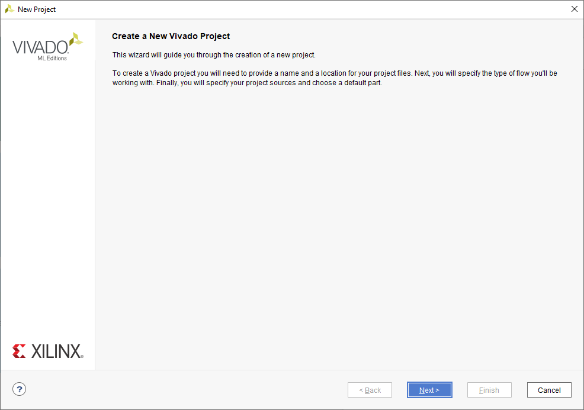

### 1 Вступ
У цій вправі ви ознайомитесь з основами роботи з платою розробки програмованої логічної інтегральної схеми (FPGA). Спочатку ви отримаєте загальне уявлення про те, що потрібно для опису апаратного дизайну на FPGA. Далі ви пройдете кроки розгортання базового дизайну на FPGA, дослідите його функціональність та зрозумієте його компоненти. Нарешті, ви перевірите свої знання, взявши інший дизайн, який додає нову функціональність, але також містить деякі недоліки. Ви розгорнете цей дизайн і виправите його, щоб він працював правильно.

Більшість запитань у цій вправі сформульовані відкрито, оскільки вони стосуються принципів і концепцій, а не конкретних рішень. Щоб забезпечити найкращий навчальний досвід, обговорюйте виникаючі запитання та свої відповіді на проблеми з одним із асистентів час від часу. Активна комунікація з викладачами є ключем до успішного виконання вправи.


### 2 Підготовка
#### Завдання 1 (Налаштування):
Налаштуйте робочий каталог для цієї вправи, виконавши наш інсталяційний скрипт і перейшовши до щойно створеного каталогу:
```bash
sh > /home/vlsi1/ex1/install.sh  
sh > cd ex1
```

### 3 Опис апаратного забезпечення на FPGA
Перед тим, як зануритись у використання інструментів, розглянемо короткий огляд опису апаратного забезпечення на FPGA.

#### 3.1 Ресурси FPGA
Кожна FPGA складається з фіксованого набору базових елементів різних типів. Налаштовуючи та з'єднуючи ці елементи у власний спосіб, ви, як розробник апаратного забезпечення, можете реалізувати користувацькі дизайни на готовій FPGA.

Xilinx Zynq-7020 System-on-Chip (SoC), з яким ви працюєте, має п'ять різних типів базових елементів FPGA: конфігуровані логічні блоки (CLB), блочні запам'ятовуючі пристрої з довільним доступом (BRAM), блоки цифрової обробки сигналів (DSP), блоки введення/виведення (IOB) та ресурси тактування. На рисунку 1а показано структуру FPGA серії Xilinx 7, які мають однакові елементи з родиною Zynq-7000. FPGA організована у кілька областей тактування (шість блоків на рисунку), кожна з яких містить 50 CLB. Основна обробка виконується CLB та DSP, які працюють із BRAM, але розуміння ресурсів введення/виведення та тактування також є важливим. Нижче подано короткий огляд кожного типу елементів.

#### 3.1.1 Конфігурований логічний блок (CLB)
Кожен CLB складається з двох логічних слайсів. Спрощену діаграму слайсу CLB показано на рисунку 1b. Кожен слайс містить:
- Чотири таблиці відповідностей (LUT) з шістьма незалежними входами та двома незалежними виходами. LUT може реалізовувати будь-яку булеву функцію своїх входів, зберігаючи та обчислюючи таблицю істинності функції.
- Вісім тригерів (FF), які можуть зберігати виходи LUT.
- Один 4-бітний арифметичний ланцюжок переносу.
- Чотири 1-бітні функціональні мультиплексори.

Від 25 до 50 % усіх слайсів можуть використовувати кожен зі своїх LUT як 64 × 1-бітну розподілену пам’ять, як 32-бітний регістр зсуву або як два 16-бітні регістри зсуву. Ця меншість слайсів належить до типу SLICEM (оптимізована для пам'яті), тоді як більшість належать до типу SLICEL (оптимізована для логіки). Інструменти синтезу враховують властивості та індивідуальні можливості кожного слайсу та автоматично намагаються використовувати їх оптимальним чином.

> Для отримання додаткової інформації див. посібник користувача для конфігурованого логічного блоку FPGA серії 7 від Xilinx (UG474).


   

(a) Організація FPGA серії Xilinx 7.

LUT  
SLICE  
LUT  
LUT  
LUT  


(b) Спрощена блок-схема  слайсу CLB.


(c) Інтерфейс BRAM,  налаштованого в режимі двох портів.


(d) Основна функціональність  DSP-слайсу.

**Рисунок 1**: Основні функціональні блоки FPGA серії Xilinx 7.


### 3.1.2 Блоки оперативної пам’яті з довільним доступом (BRAM)
Кожен BRAM зберігає до 36 Кібіт даних. У типовій конфігурації BRAM містить 1024 записи, кожен з яких має ширину 36 біт (32 біти плюс один біт парності на байт). BRAM дуже гнучкий у налаштуванні кількості записів і ширини кожного запису. У режимі з двома портами — інтерфейс якого показано на рис. 1c — кожен BRAM має два незалежні порти з вхідними даними (32+4) біти, можливістю байтового запису, 16-бітною адресою, вихідними даними (32+4) біти та окремими сигналами тактування, скидання і включення.

### 3.1.3 Цифровий сигналопроцесорний (DSP) блок
Основна функціональність DSP-блоку показана на рис. 1d. Кожен блок включає 25×18-бітний множник з доповненням до двійкового коду, 48-бітний акумулятор, 25-бітний передаддер, додатковий логічний блок для генерації до 10 різних логічних функцій для двох операндів та детектор шаблонів для округлення. Кожен DSP-блок також містить додаткові вхідні, конвеєрні та вихідні регістри. Для повної швидкості операцій множення та накопичення необхідно щонайменше три конвеєрні регістри.

### 3.1.4 Блоки введення/виведення (IOB)
Існує два типи блоків введення/виведення (IOB): високопродуктивні (HP) та широкодіапазонні (HR). HP-блоки розроблені для задоволення вимог високошвидкісної пам'яті та інших інтерфейсів між чіпами з напругою до 1,8 В. HR-блоки підтримують ширший діапазон стандартів введення/виведення з напругою до 3,3 В. IOB також мають можливість програмування затримки введення/виведення, серіалізатори/паралелізатори та програмовану опорну напругу.

### 3.1.5 Ресурси тактування
FPGA має три рівні тактування: входи, що підтримують тактування, глобальні та регіональні ресурси тактування. Зовнішній тактовий сигнал подається через спеціальні входи, які забезпечують швидкісний доступ до глобальних ресурсів тактування через спеціальні лінії передачі. Глобальні ресурси тактування складаються з тактового модуля керування (CMT) та глобальних буферів тактування, які створюють копії вхідного тактового сигналу для кількох навантажень з мінімальними перешкодами та швидким перехідним процесом.

### 3.2 Процес проєктування та впровадження FPGA
Рисунок 2 показує процес проєктування FPGA від специфікацій користувача до налаштування FPGA.


Ви проведете значну частину курсу на етапі перетворення алгоритму в апаратну архітектуру, описану на рівні регістрів (RTL). Для одного алгоритму може бути безліч різних апаратних архітектур, кожна з яких має свої компроміси. Як тільки апаратну частину описано, можливості змін властивостей фінального обладнання обмежені.

Світло-сірі блоки представляють етапи, які проходить ваше проєктування перед впровадженням на FPGA. У цьому завданні ви пройдете ці етапи. Хоча більшість з них автоматизовані, важливо розуміти їхню суть і як це впливає на проєктування. Розглянемо кожен етап.

#### 3.2.1 Розробка
Під час цього етапу генерується нетліст з логічних і арифметичних елементів на основі опису RTL. Наприклад, додавання двох сигналів перетворюється в суматор із відповідними входами. Цей етап не залежить від технології. Розробка нетліста займає кілька хвилин і зазвичай триває лічені секунди для невеликих проєктів.

#### 3.2.2 Синтез
Під час синтезу нетліст прив'язується до елементів обраної родини FPGA. Інструменти також надають перші оцінки використання ресурсів і часу виконання проєкту. Якщо оцінки значно відхиляються від вимог, потрібно внести зміни в опис RTL.

#### 3.2.3 Впровадження
На цьому етапі синтезований нетліст розміщується на фізичних елементах FPGA і маршрутизуються сигнали між ними. Інструменти намагаються мінімізувати затримки сигналу, але це може бути складно на щільно завантажених FPGA. Якщо дизайн не відповідає вимогам щодо ресурсів чи часу, необхідно внести зміни в RTL. 

#### 3.2.4 Генерація бістріму
Бістрім — це послідовність бітів, яка конфігурує транзистори FPGA. Під час цього етапу бістрім генерується на основі впровадженого нетліста.


### 3.3 Передача даних до і з FPGA
FPGA обмінюється даними з периферійними пристроями через порти введення/виведення (I/O), яких у них досить багато. Наприклад, навіть відносно невеликий пристрій, який є перед вами, має 100 користувацьких конфігурованих портів введення/виведення. На платі розробки більшість портів підключені до периферійних пристроїв. Серед них є як прості периферії, такі як кнопки, перемикачі та світлодіоди, так і складніші пристрої, такі як пам'ять, інші інтегральні схеми, порти для високошвидкісної передачі даних (наприклад, Ethernet, USB), а також відеопорти (один HDMI вхід і один вихід).

Ці різноманітні периферійні пристрої мають різні електричні вимоги до струму та напруги, а також до часу. Крім того, одна FPGA повинна мати можливість працювати з різними пристроями та друкованими платами.

Щоб забезпечити таку гнучкість, I/O ресурси FPGA мають високий рівень конфігурації (як коротко згадувалося у розділі 3.1.4). Ця конфігурація визначається на етапі проєктування у файлі з обмеженнями. У цьому файлі також визначаються внутрішні імена для сигналів на I/O-виводах.

### 4 Програмування плати розробки FPGA
Більшість плат для розробки FPGA мають джампери для встановлення або розриву з'єднань на друкованій платі. Щоб уникнути пошкодження плати, завжди перевіряйте правильність налаштувань джамперів перед підключенням її до будь-яких пристроїв.

На платі Zybo джампери використовуються для вибору джерела живлення (варіанти: розетка, програмувальний USB-порт або батарея) і джерела бістріму FPGA (варіанти: SD-карта, флеш через QSPI або JTAG). Ми будемо живити Zybo через програмувальний USB-порт і завантажувати бістрім через робочу станцію, підключену до JTAG.

#### Завдання студента 2 (Контроль і налаштування джамперів):
Перед підключенням плати FPGA переконайтеся, що джампери налаштовані так:
- Джампер вибору живлення, JP6 (у верхньому лівому куті), має бути встановлений на USB, тобто має з'єднувати VU5V0 з USB.
- Джампер режиму програмування, JP5 (у верхньому правому куті), має бути встановлений на JTAG, тобто в крайнє праве положення.


 

#### Завдання студента 3 (Підключення плати):
Підключіть USB-кабель до роз'єму PROG UART на платі FPGA і до одного з передніх USB-портів вашої робочої станції. Увімкніть плату та переконайтеся, що світлодіод PGOOD загорівся та постійно світиться.


FPGA тепер готова до програмування. Ми будемо використовувати середовище розробки Xilinx Vivado для завантаження вступного дизайну.

#### Завдання студента 4 (Запуск Vivado):
У вашій папці ex1 перейдіть до папки `intro/vivado` і запустіть Xilinx Vivado 2017.2 командою:

```sh
vivado-2017.2 vivado
```


Ви потрапите на екран привітання Vivado. Інструмент має меню зверху, велику робочу область посередині (де відображаються загальні точки входу та останні проєкти), а також консоль унизу.

Як і більшість інструментів для автоматизованого проєктування, Vivado можна керувати через графічний інтерфейс (GUI) або через вбудовану консоль Tcl (мова сценаріїв для командного інтерпретатора). GUI зазвичай є більш інтуїтивним, але для автоматизації повторюваних завдань можна використовувати консоль. Vivado показує команди, які відповідають вашим діям у GUI, у консолі синім кольором.

### Примітка 1 (Рекомендації щодо використання GUI і консолі в інструментах CAE/CAD):
Використовуйте GUI та консоль доповнюючи одне одного. Коли ви виконуєте завдання вперше, використовуйте GUI. Команди, які відповідають вашим діям, з’являються в консолі. Якщо вам потрібно автоматизувати ці дії, збережіть команди у файл сценарію.

#### Завдання студента 5 (Створення сценарію для Vivado):
Створіть файл `intro/vivado/init_proj.tcl` і відкрийте його в редакторі. Під час виконання дій у GUI стежте за командами, які відображаються в консолі Vivado, та додавайте їх до цього файлу. Цей сценарій пізніше буде використовуватися для налаштування нового проєкту.

#### Завдання студента 6 (Створення нового проєкту Vivado):
- У вікні Quick Start натисніть **Create Project**.
- Натисніть **Next**, назвіть проєкт "intro" та переконайтеся, що він буде створений у папці `intro/vivado`.
- На наступному екрані оберіть **RTL Project** та переконайтеся, що **Do not specify sources at this time** не вибрано.
- Натисніть **Next**, додайте папку `intro/sourcecode` як джерело.
- Переконайтеся, що обрані налаштування відповідно до інструкцій, і завершіть створення проєкту.




#### Завдання студента 7 (Вибір стратегії синтезу та впровадження):
Перейдіть до налаштувань проєкту та виберіть стратегію **Flow_RuntimeOptimized** для синтезу та впровадження.

#### Завдання студента 8 (Генерація бістріму):
Запустіть генерацію бістріму через меню **Generate Bitstream** і налаштуйте максимальну кількість паралельних процесів.

#### Завдання студента 9 (Програмування FPGA):
Підключіться до плати через **Open Hardware Manager** і натисніть **Program Device**, щоб запрограмувати FPGA.


## 5 Розуміння вступного проєкту

Давайте спробуємо зрозуміти реалізовану схему, експериментуючи з нею на платі FPGA. Схема має два простих режими, які можна перемикати за допомогою крайньої правої кнопки (позначена як BTN0). Інші три кнопки і чотири перемикачі виступають як входи, а чотири світлодіоди над перемикачами — як виходи.

### Завдання для студентів 10 (Дослідження поведінки реалізованої схеми): 
Використовуйте описані вище входи та виходи, щоб дослідити поведінку схеми. Як би ви описали два режими? Як входи впливають на виходи в кожному з режимів?

### 5.1 Досліджена схема

Натискати кнопки і здогадуватися про функціональність може бути цікавим заняттям, але це не найнадійніший спосіб охарактеризувати схему. Натомість давайте відкриємо блок-схему дослідженого проєкту у Vivado і на основі цього зробимо свою блок-схему та опис блоків.

### Завдання для студентів 11 (Перегляд схеми дослідженого проєкту): 
Розгорніть пункт **Open Elaborated Design** у навігаторі та натисніть на **Schematic**. Vivado зараз досліджує проєкт і представляє вам мережевий список ліворуч і схему праворуч. Обидва списки є ієрархічними, і їх можна розгорнути, але нас наразі цікавить верхній рівень. Максимізуйте вікно **Schematic**.


Входи схеми (годинник, кнопки та перемикачі) знаходяться зліва, виходи (світлодіоди) — праворуч. Два режими реалізовані в двох блоках, які мультиплексуються на світлодіодах. Вихідний мультиплексор керується з регістра, що перемикається крайньою правою кнопкою.


Хоча перемикачі можна безпосередньо використовувати як входи в цій схемі, кнопки повинні бути оброблені для усунення "дребезгу", перш ніж їх можна буде використовувати: коли механічний контакт закривається або відкривається, його електричний вихід осцилює (або "дребезжить") деякий час, перш ніж встановитися на певне значення. **Debouncer** — це простий блок, який перемикає свій вихід лише в тому випадку, якщо його вхід залишається стабільним протягом заданої кількості тактів годинника. Оскільки нас цікавить лише подія "кнопка натиснута", оброблений сигнал подається через інший простий блок, який видає одноцикловий імпульс, коли його вхід змінюється з 0 на 1.

### Завдання для студентів 12 (Розробка блок-схеми верхнього рівня): 
На основі схеми дослідженого проєкту у Vivado та наведеного вище опису створіть власну блок-схему верхнього рівня. Порада: ви можете зробити свою схему більш інтуїтивною, згрупувавши схожі блоки, об'єднавши тісно пов'язані блоки, а також додати блок для схеми, що керує мультиплексором. Ви також можете проаналізувати файли початкового коду, щоб краще зрозуміти дизайн.

Ви можете запитати себе, як Vivado визначає, які входи і виходи має схема, і як вони підключені. Зрештою, схема верхнього рівня починається з вхідних портів зліва і закінчується вихідними портами праворуч. Ці порти описані у файлі обмежень.

### Завдання для студентів 13 (Розуміння файлу обмежень): 
Зменшіть вікно **Schematic** і перейдіть на вкладку **Sources** у вікні ліворуч від схеми. Відкрийте файл **zybo-z7.xdc** у папці **Constraints/constrs_1** за допомогою подвійного кліку. Цей файл містить команди Tcl, специфічні для Vivado, які визначають порти. Яка три інформаційні елементи необхідні для з'єднання внутрішнього сигналу із зовнішнім через контакт FPGA?

Окрім цієї інформації, усі не годинникові входи та виходи повинні бути обмежені вхідною та вихідною затримкою відповідно. У нашому випадку всі входи та виходи асинхронні: перемикачі, кнопки та світлодіоди не мають відношення до годинника FPGA. Таким чином, на них не можна визначити реалістичну вхідну або вихідну затримку. Натомість їх позначають як **false paths** і присвоюють їм довільну затримку, що дорівнює нулю.

Наступні два завдання спрямовані на загальне розуміння функціональності блоків. Не намагайтеся детально зрозуміти поведінку всіх блоків задля економії часу.

### Завдання для студентів 14 (Розуміння допоміжних блоків): 
Максимізуйте вікно **Schematic** знову та розгорніть схему одного з **rising_edge_pulsers**, натиснувши на плюсик у його верхньому лівому куті. Які комбінаційні та послідовні (тобто такі, що зберігають стан) елементи він використовує? Як вони з'єднані для реалізації описаної функціональності?

Розгорніть схему одного з **debouncers**. Які елементи утворюють його стан, і як вони контролюються? Що керує його виходом? Опишіть загалом, як він реалізує описану функціональність. Порада: зосередьтеся на регістрах та лічильниках і не відволікайтеся на велику кількість мультиплексорів. Ми також рекомендуємо проаналізувати вихідний код, щоб краще зрозуміти дизайн.

Оцініть, скільки тактів годинника вхід повинен бути стабільним, щоб вплинути на вихід. (Розрахуйте верхню межу цієї кількості.) Припускаючи, що частота годинника становить 100 МГц, скільки це часу в реальних умовах? Порада: зверніть увагу на лічильник.

### Завдання для студентів 15 (Розуміння основних блоків): 
Розгорніть схему блоку **led_switcher**. Що він робить?  
Розгорніть схему блоку **led_toggler**. Що він робить? Які елементи утворюють його стан, і як вони контролюються? Що керує його виходом?

Ці схеми показують логічні структури, які Vivado генерує на основі описаного дизайнером обладнання. Однак, поведінковий код на мові опису апаратури (HDL) зазвичай містить набагато більше інформації про наміри дизайнера. Коли це можливо, розуміння цього коду є ключем до розуміння схеми. На даний момент ви ще не навчені читати код HDL. Проте, ви можете отримати перше уявлення і спробувати зрозуміти структуру коду, що описує блоки, з якими ви вже познайомилися.

### Додаткове завдання для студентів 16 (Огляд коду HDL блоків):
Зменшіть вікно **Schematic** і в дереві **Netlist** зліва двічі клацніть на найпростішу одиницю — **led_switcher**. У новому вікні буде показаний код **SystemVerilog** для цього блоку. Після вступного коментаря заголовка ви знайдете оголошення модуля блоку. Що воно описує?

Далі у файлі описується внутрішня структура і реалізація модуля. Яка інструкція з'єднує один сигнал з іншим у **SystemVerilog**?

Потім перегляньте код **rising_edge_pulser**. Які елементи коду утворюють регістр, що зберігає вхід попереднього такту годинника? Яка інструкція визначає вихід?

Нарешті, відкрийте код топ-модуля **zybo_top**. Ви вже знайомі з оголошенням модуля, але реалізація містить деякі нові конструкції. Що вони роблять?

До цього моменту ви бачили одну інструкцію для з'єднання двох сигналів у **SystemVerilog**. Як більшість сигналів з'єднані в цій реалізації?

У цьому коді також визначена затримка для **debouncers**. Яке її значення, і чи відповідає воно тому, що ви очікували?

Ви також можете переглянути код **debouncer** та **led_toggler**, але на даний момент вам не обов'язково повністю розуміти їх.

### 5.2 Синтезована схема

Залишимо досліджену схему та перейдемо до більш специфічної для FPGA синтезованої схеми. (Якщо ви не впевнені в різниці, зверніться до вступу.)

### Завдання для студентів 17 (Перегляд схеми синтезованого дизайну):
Розгорніть пункт **Open Synthesized Design** у навігаторі та натисніть на **Schematic**. Як ця схема порівнюється зі схемою дослідженої схеми (подібності, відмінності)?

З яких типів блоків складається схема? Як вони реалізують функціональність схеми?

Куди подівся блок **led_switcher**?

Після відображення функціональності у реальні елементи FPGA можна отримати перші оцінки щодо таймінгу та використання ресурсів.

### Завдання для студентів 18 (Розуміння звіту по таймінгу):
Натисніть **Report Timing Summary** і підтвердіть параметри за замовчуванням. Звіт по таймінгу відкриється у новій вкладці вікна внизу. Який період і частота годинника?

Чи відповідає схема таймінговим вимогам і чи може вона працювати ще швидше? Якщо так, до якої максимальної частоти?

Де в схемі знаходиться найдовший шлях?

Що більше впливає на цей шлях: логічні елементи чи маршрутизація сигналів?

Наскільки можна довіряти таким детальним результатам на цьому етапі і чому?

Таймінгові оцінки після синтезу зазвичай менш обмежувальні, ніж після реалізації. Тому, якщо ваша схема не відповідає вимогам після синтезу, шанси на успіх після реалізації є низькими.

### Завдання для студентів 19 (Розуміння звіту по використанню ресурсів):
Натисніть **Report Utilization** і підтвердіть параметри за замовчуванням. Звіт по використанню відкриється у новій вкладці вікна внизу. Натисніть на **Summary**. Які типи ресурсів FPGA використовуються в схемі? Наскільки сильно використовується FPGA?

Натисніть на **Hierarchy**. Який блок використовує найбільше ресурсів і які саме типи ресурсів? Чи очікували ви такого розподілу ресурсів, коли ми вперше описували функціональність блоків?

Під час синтезу Vivado вже розподілило декілька елементів на FPGA. Вкладка **Device** показує розміщення елементів на FPGA і як їх використовують.

### Додаткове завдання для студентів 20 (Розуміння огляду пристрою):
Відкрийте вкладку **Device** для синтезованого проєкту і спробуйте зіставити показане розміщення з вашим знанням внутрішніх структур FPGA. Ви можете збільшити масштаб за допомогою комбінації **Ctrl + колесо миші** та панорамувати, утримуючи середню кнопку миші та переміщаючи курсор. Що являють собою шість великих прямокутних зон?

Які типи колонок існують у кожній зоні?

Які "особливі" колонки існують тільки в певних місцях?

Що являють собою клітинки на правому краю пристрою?

Більшість клітинок у схемі не заповнені кольором, тобто вони не (поки що) використані. Однак деякі клітинки вже заповнені. Які це клітинки і чому Vivado змогло розмістити елементи схеми тут ще до фактичної фази розміщення?

### 5.3 Реалізована схема

Нарешті, ми перевіримо реалізований проєкт. (Зверніться до вступу, якщо ви не впевнені, що відбувається з синтезованою схемою під час реалізації.) Оскільки ми нещодавно переглядали пристрій синтезованої схеми, почнемо з огляду пристрою реалізованого проєкту.

### Завдання для студентів 21 (Розуміння реалізації на пристрої):
Натисніть **Open Implemented Design** у навігаторі процесу та перейдіть на вкладку **Device** (якщо вона не відкрита). Декілька клітинок заповнені, і вони розміщені досить щільно в одному місці. Які причини такого розміщення?

Залишаючись у "макроскопічному" вигляді, відкрийте вкладку **Netlist** (ліворуч від вікна **Device**). Зафарбуйте клітинки, що реалізують різні блоки, різними кольорами: для кожного запису першого рівня у списку **Netlist** клацніть правою кнопкою миші по запису і виберіть колір у **Highlight Leaf Cells**. Що ви спостерігаєте?

У вкладці **Netlist** виберіть три мережі **clk i***, клацніть правою кнопкою миші та виділіть їх кольором. Як сигнал годинника потрапляє на FPGA і як він розподіляється між блоками схеми? Який елемент FPGA відіграє центральну роль у цьому процесі, і де він розташований?

Нарешті, збільшіть масштаб одного зі слайсів, поки він не займе весь екран. Які елементи він містить і як вони використовуються? Огляньте різні слайси, які реалізують різні частини схеми. Які елементи слайсів часто використовуються, а які — майже ніколи? Чому?

### Додаткове завдання для студентів 22 (Порівняння пост-реалізації та пост-синтезу):
Згенеруйте звіт по таймінгу для реалізованого проєкту і порівняйте його з таймінговим звітом синтезованої схеми. Як змінився найдовший шлях? Чи включає він той самий клас кінцевих точок? Чи змінилася загальна затримка, і якщо так, яка частина шляху спричинила цю зміну?

Згенеруйте звіт по використанню ресурсів для реалізованого проєкту та порівняйте його зі звітом по синтезу. Як змінилося загальне використання ресурсів і чому? Як змінилося використання ресурсів окремими блоками?

Порада: порівняйте схеми одного блоку у синтезованому та реалізованому проєкті, клацнувши правою кнопкою миші по блоку в ієрархії використання і відкривши його схему.


### 6. Розгортання та виправлення розширеного дизайну

Час звернути увагу на більш функціонально цікавий дизайн! На жаль, нам не вистачило часу, щоб завершити його реалізацію — тому ми вирішили зробити це вашим завданням! :)

### Завдання для студентів 23 (Налаштування нового проєкту в Vivado):
Закрийте поточну сесію Vivado, перейдіть у директорію **work_in_progress/vivado** і запустіть Vivado звідти. Якщо ви створили скрипт для налаштування минулого проєкту, скопіюйте цей файл до підкаталогу **scripts/init_proj.tcl**, змініть назву проєкту та шляхи до вихідних і файлів обмежень, а потім виконайте його в консолі Vivado, ввівши:

```
source ./scripts/init_proj.tcl
```

Якщо ви не створювали такий скрипт, налаштуйте новий проєкт з відповідними параметрами.

Підказка: Ви можете зробити ваш скрипт **init_proj.tcl** більш універсальним, включивши всі файли в директорії з вихідним кодом замість явного перерахування кожного файлу. Для цього замініть оператор:

```
add_files { ... }
```

на:

```
add_files [glob ../sourcecode/*]
```

### Завдання для студентів 24 (Генерація і розгортання бітстріму):
Згенеруйте бітстрім для проєкту. Були певні проблеми з цим дизайном у минулому, і наша команда верифікації його ще не затвердила (хоча відповідальний інженер впевнено стверджує, що все працює як слід...). У будь-якому випадку, уважно спостерігайте за попередженнями та помилками у вікні **Messages**. Зафіксуйте будь-які серйозні проблеми, які ви знайдете, і те, як їх виправити.

Підказка: Хоча дизайнери RTL часто дуже впевнені у своєму коді, на цьому етапі з кодом RTL все гаразд (хоча пізніше, можливо, доведеться його налагоджувати). **vimdiff** може бути корисним інструментом для порівняння змін.

Після отримання бітстріму завантажте його на FPGA.

Наразі дизайн ще не документовано, але малюнок на дошці в кімнаті для кави свідчить, що він має три режими: перші два режими були запозичені з попереднього дизайну, а третій режим був спеціально розроблений для клієнта з кіноіндустрії. Клієнт дуже поспішав із завершенням фільму, тому ми не встигли належним чином перевірити цей режим. Однак схема повинна працювати ідеально, оскільки ми всі — генії, і функціональність схеми набагато простіша за наші інтелектуальні здібності! :)

### Завдання для студентів 25 (Тестування та виправлення основної функціональності):
Скористайтеся кнопками та перемикачами для перевірки функціональності перших двох режимів. Чи можете ви підтвердити, що все працює як раніше? Якщо ні, які проблеми ви помічаєте і як їх можна виправити?

Підказка: Є рівно дві конкретні проблеми: одна у файлі обмежень, а інша — у верхньому рівні RTL-коду. Жодна з проблем не стосується коду у підмодулях. Щоб знайти першу проблему, уважно перевірте піни світлодіодів. Щоб знайти другу проблему, переконайтеся, що всі кнопки правильно працюють із антидребезковим фільтром.

(Відкрийте файл **task.pdf** у вашій директорії з завданнями та позначте прозорий текст вище, щоб побачити підказки.)

### Додаткове завдання для студентів 26 (Дослідження третього режиму):
Після перевірки основної функціональності можна визнати, що команда, відповідальна за третій режим, виконала досить хорошу роботу. Який візуальний ефект вони реалізували?

Відкрийте схему третього режиму. Він складається з трьох логічних частин: двох лічильників і вихідних драйверів. Що означають лічильники? Як контролюються вихідні драйвери?

Намалюйте спрощену блок-схему блоку, що реалізує третій режим.

Широтно-імпульсний модулятор (PWM), який керує світлодіодами в третьому режимі, є центральним блоком для генерування сигналів, які сприймаються як аналогові (середнє значення за часом), а не як дискретні цифрові імпульси. Наприклад, для світлодіодів людське око не бачить серії цифрових спалахів, а радше постійне світло змінної яскравості. Оскільки людське око сприймає яскравість логарифмічно, схема використовує логарифмічні рівні яскравості для управління світлодіодами.

### Додаткове завдання для студентів 27 (Розуміння реалізації PWM):
Дослідіть схему та RTL-код **pulse_width_modulator** та **log_pulse_width_modulator** відповідно. Поясніть їх досить просту реалізацію:

Логарифмічний PWM в основному виконує те ж саме, що і стандартний PWM. Як це реалізовано без дублювання однакової логіки?

---


###                                                                                                                                                                                          Додаток


### Пояснення файлу обмежень для плати Zybo-Z7

Цей файл `.xdc` задає обмеження для плати Zybo-Z7 (сумісний з Z7-20 та Z7-10) і визначає відповідність фізичних контактів плати (пінів) логічним сигналам дизайну на FPGA. Ось пояснення основних розділів:

---

### 1. **Джерело тактового сигналу (Clock Source)**

```tcl
set_property -dict { PACKAGE_PIN K17  IOSTANDARD LVCMOS33 } [get_ports { clk_i }];
create_clock -add -name sys_clk -period 8.00 -waveform {0 4} [get_ports { clk_i }];
```
- **PACKAGE_PIN K17**: Це означає, що вхідний тактовий сигнал (clk_i) підключений до піна K17 на платі Zybo-Z7.
- **IOSTANDARD LVCMOS33**: Визначає стандарт логіки для цього піна як LVCMOS33, тобто логіка з напругою 3.3 В.
- **create_clock**: Створюється тактовий сигнал з ім'ям `sys_clk` з періодом 8 нс (125 МГц) і чергуванням 50% (4 нс "high" та 4 нс "low").

---

### 2. **Перемикачі (Switches)**

```tcl
set_property -dict { PACKAGE_PIN G15  IOSTANDARD LVCMOS33 } [get_ports { switch_i[0] }];
set_property -dict { PACKAGE_PIN P15  IOSTANDARD LVCMOS33 } [get_ports { switch_i[1] }];
set_property -dict { PACKAGE_PIN W13  IOSTANDARD LVCMOS33 } [get_ports { switch_i[2] }];
set_property -dict { PACKAGE_PIN T16  IOSTANDARD LVCMOS33 } [get_ports { switch_i[3] }];
set_false_path -from [get_ports {switch_i*}] -to *
set_input_delay -clock sys_clk 0.0 [get_ports {switch_i*}];
```
- **switch_i[0], switch_i[1], ...**: Піни для 4-х перемикачів (SW) плати визначаються як вхідні сигнали `switch_i[0]`, `switch_i[1]`, тощо.
- **PACKAGE_PIN**: Кожен перемикач прив'язаний до відповідного піна на платі.
- **set_false_path**: Вказується, що шлях сигналів від перемикачів не враховуватиметься при аналізі часу, оскільки перемикачі зазвичай змінюються рідко і не є критичними для затримки.
- **set_input_delay**: Визначає затримку в 0 нс для цих вхідних сигналів відносно тактового сигналу `sys_clk`.

---

### 3. **Кнопки (Buttons)**

```tcl
set_property -dict { PACKAGE_PIN K18  IOSTANDARD LVCMOS33 } [get_ports { btn_i[0] }];
set_property -dict { PACKAGE_PIN P16  IOSTANDARD LVCMOS33 } [get_ports { btn_i[1] }];
set_property -dict { PACKAGE_PIN K19  IOSTANDARD LVCMOS33 } [get_ports { btn_i[2] }];
set_property -dict { PACKAGE_PIN Y16  IOSTANDARD LVCMOS33 } [get_ports { btn_i[3] }];
set_false_path -from [get_ports {btn_i*}] -to *
set_input_delay -clock sys_clk 0.0 [get_ports {btn_i*}];
```
- **btn_i[0], btn_i[1], ...**: Вхідні сигнали від 4-х кнопок (BTN) плати.
- **PACKAGE_PIN**: Кожен сигнал кнопки прив'язаний до певного піна на платі.
- **set_false_path**: Аналогічно перемикачам, шляхи сигналів кнопок не враховуються при аналізі часу.
- **set_input_delay**: Затримка в 0 нс для вхідних сигналів кнопок відносно тактового сигналу.

---

### 4. **Світлодіоди (LEDs)**

```tcl
set_property -dict { PACKAGE_PIN M14  IOSTANDARD LVCMOS33 } [get_ports { led_o[0] }];
set_property -dict { PACKAGE_PIN M15  IOSTANDARD LVCMOS33 } [get_ports { led_o[1] }];
set_property -dict { PACKAGE_PIN G14  IOSTANDARD LVCMOS33 } [get_ports { led_o[2] }];
set_property -dict { PACKAGE_PIN D18  IOSTANDARD LVCMOS33 } [get_ports { led_o[3] }];
set_false_path -from * -to [get_ports {led_o*}];
set_output_delay -clock sys_clk 0.0 [get_ports {led_o*}];
```
- **led_o[0], led_o[1], ...**: Вихідні сигнали для 4-х світлодіодів (LED) плати.
- **PACKAGE_PIN**: Прив'язка кожного світлодіода до певного піна на платі.
- **set_false_path**: Вказує, що шляхи сигналів до світлодіодів не є критичними і не повинні враховуватися при аналізі часу.
- **set_output_delay**: Встановлює затримку в 0 нс для вихідних сигналів світлодіодів відносно тактового сигналу `sys_clk`.

---

### Загальні висновки:
Цей файл визначає:
- Фізичну прив'язку сигналів (тактовий сигнал, перемикачі, кнопки, світлодіоди) до пінів на платі.
- Стандарти напруги логіки (LVCMOS33) для сигналів.
- Встановлення шляхів, які можна ігнорувати при аналізі затримок (false path), а також вхідні і вихідні затримки для сигналів. 

Це допомагає FPGA коректно працювати з сигналами та забезпечує оптимальне використання ресурсів плати для даного проекту.


### Опис складної цифрової схеми

Ця цифрова схема виглядає частиною більшого проекту, ймовірно розробленого для FPGA або ASIC. Ось ключові компоненти та особливості, які можна виділити:

---

### 1. **Блоки "gen_ten_pulses"**:
- Це, ймовірно, генератори імпульсів або лічильники, які генерують певну кількість імпульсів, зокрема 10 імпульсів. Такі блоки можуть використовуватися для створення регулярних часових інтервалів або для лічильників.

### 2. **Блоки "rising_edge_pulser"**:
- Ці блоки, ймовірно, генерують імпульс при появі сигналу на передньому фронті (різке зростання) вхідного сигналу. Вони можуть використовуватись для синхронізації або ініціації певної дії при зміні сигналу з низького рівня на високий.

### 3. **Мультиплексори (MUX)**:
- Компоненти, позначені як "RTL_MUX", є мультиплексорами, які перемикають між різними вхідними сигналами на основі керуючого сигналу. Це корисно для вибору одного сигналу з кількох можливих на основі поточного стану керування.

### 4. **Логічна операція AND**:
- Блок "RTL_AND" реалізує логічну операцію "І" (AND), яка виводить високий рівень тільки тоді, коли всі вхідні сигнали мають високий рівень.

### 5. **Синхронний регістр ("RTL_REG_SYNC")**:
- Цей блок представляє синхронний регістр, який зберігає значення даних під управлінням тактового сигналу (clk). Він синхронізує дані, записуючи їх при певних подіях, наприклад, на передньому фронті тактового сигналу.

### 6. **Вхідні та вихідні порти**:
- Є кілька важливих портів:
  - **clk_i**: вхідний тактовий сигнал.
  - **ten_pulse_i**: вхідний сигнал від генератора 10 імпульсів.
  - **led_o**: вихідний сигнал, ймовірно для управління світлодіодами (LED).

### 7. **Компоненти порівняння і додавання**:
- Блоки "RTL_LT" і "RTL_ADD" можуть виконувати операції порівняння (менше ніж) і додавання відповідно. Це можуть бути компоненти, що використовуються для обробки числових даних, лічильників або управління логікою.

### 8. **Змішування шини (bus) і однобітних з'єднань**:
- Деякі з'єднання в схемі є багаторозрядними (bus), що означає, що вони обробляють більше одного біта одночасно. Це корисно для передачі даних або адрес, у той час як інші з'єднання є однобітними, які використовуються для простих логічних операцій.

### 9. **Загальна структура проекту**:
- Вкладки вгорі вказують на те, що це частина більшого проекту для плати Zybo, оскільки там згадуються файли "zybo_top.sv" (верифікаційний файл для топології) і "zybo-z7.xdc" (файл обмежень для Zybo-Z7).
- Цей проект має 19 підсхем (Cells), 13 вхідних/вихідних портів (I/O Ports) і 39 мереж з'єднань (Nets).

### 10. **Призначення схеми**:
- Схема, ймовірно, реалізує обробку імпульсів або таймінгів. Наявність генераторів імпульсів і детекторів переднього фронту сигналу свідчить про те, що це може бути частиною складної системи синхронізації або керування послідовностями подій.

---

### Висновок:
Ця схема, ймовірно, призначена для виконання завдань, пов'язаних з генерацією та обробкою імпульсів на FPGA платі Zybo-Z7, і є частиною більшого проекту для синхронізації або керування сигналами на основі тактового сигналу.


