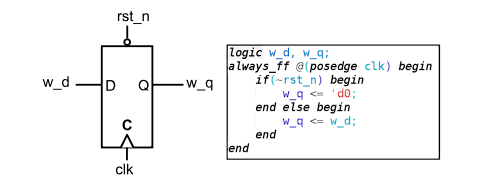
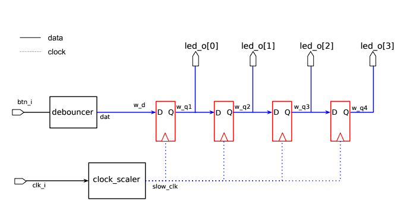
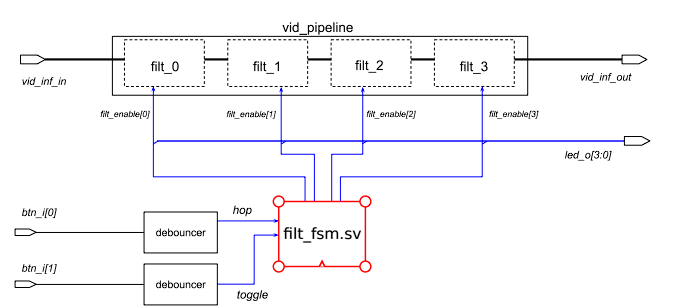
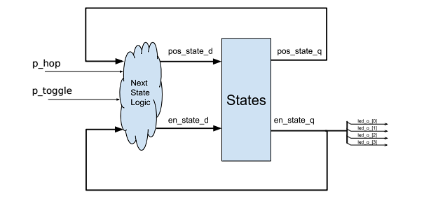
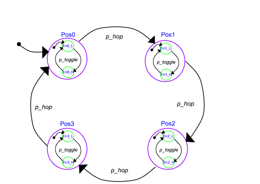
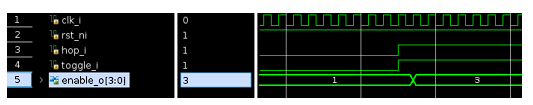
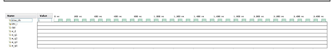
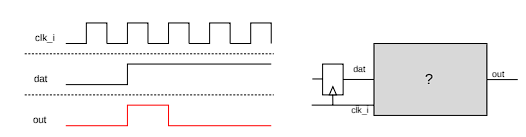

Кафедра інформаційних технологій та електротехніки

VLSI I:
Від архітектур до VLSI схем та ПЛІС

227-0116-00L

Вправа 3

HDL кодування: Послідовні схеми

Проф. Л. Беніні
Ф. Гюркайнак
М. Корб

Останні зміни: 2024-09-30 14:34:02 +0200

### 1 Вступ

У цій вправі ви вивчите основи послідовних схем. Послідовні схеми є елементами, що зберігають стан в проекті. Поєднуючи їх з комбінаційними схемами, про які ви дізналися в попередній вправі, ми можемо будувати комплексні цифрові проекти. Послідовні схеми можна широко поділити на дві категорії: синхронні та асинхронні. Синхронні елементи, що зберігають стан, оновлюють свій стан лише протягом конкретних проміжків часу, що визначаються глобальним тактовим сигналом, спільним для всіх елементів зберігання в проекті. Асинхронна послідовна схема, з іншого боку, змінює свій стан залежно лише від сигналів, які не поділяються глобально. Такий тип послідовної схеми створює проблеми зі стабільністю, як ви дізнаєтесь пізніше під час курсу, тому наш фокус у цій вправі буде на синхронних послідовних схемах.

Послідовні схеми далі класифікуються як чутливі до рівня або чутливі до фронту, залежно від того, як визначається вікно часу, протягом якого оновлюється стан, відносно тактового сигналу. У проекті, чутливому до рівня, оновлення можуть відбуватися в будь-який час, коли тактовий сигнал чутливий (логічна 1), що дозволяє елементу, що зберігає стан, бути прозорим. У цій вправі ми будемо мати справу з проектами, чутливими до фронту, які обмежують час оновлень лише моментами переходу значення на синхронізуючому тактовому сигналі, тим самим запобігаючи небажаним оновленням, які можуть виникнути через більше вікно оновлення.

Фундаментальним елементом синхронної послідовної схеми, чутливої до фронту, є D-тригер, який вибирає та оновлює стан при настанні позитивного фронту тактового сигналу. Схема D-тригера з синхронним активним низьким скиданням та відповідний опис апаратури в SystemVerilog показано на Рисунку 1. Як показано на рисунку, D-тригер має вхід синхронізації C, позначений маленьким трикутником, що вказує на те, що він чутливий до позитивних фронтів тактового входу. D-вивід визначає вхід при позитивному фронті clk. C-вивід робить вибране значення доступним як вихід після позитивного фронту тактового сигналу. Нарешті, вхід скидання rst_n, підключений до сигналу R, ініціалізує збережене значення синхронно до тактового сигналу, коли застосовується нове значення. Той факт, що скидання запускається логічним низьким сигналом, показано маленьким колом на виводі скидання.



Рисунок 1: D-тригер. Схема та фрагмент коду

З іншого боку, фундаментальним елементом синхронної послідовної схеми, чутливої до рівня, є засувка. Як вже згадувалося, її вихід комбінаційно слідує за входом, коли тактовий сигнал активний, тоді як вона стабільна, коли тактовий сигнал не активний. Ми не будемо використовувати такий тип пристрою тут.

Розглянувши основи послідовного проектування, давайте тепер попрацюємо над кількома прикладами використання, де послідовні схеми стають корисними. По-перше, як розминка, ми розробимо зсувовий регістр на основі D-тригерів. Після цього починається веселе - для решти частини цієї вправи ви будете працювати з деякими високотехнологічними додатками обробки відео, щоб допомогти судовому експерту проаналізувати нечітке зображення! В процесі ви вивчите принципи проектування послідовних схем, такі як кінцеві автомати (FSM), цифрові детектори фронтів та цифрові лічильники.

Основи обробки відео, які ви вивчили в попередній вправі, стануть у нагоді, коли ви пізніше виконуватимете завдання в цій вправі. Рекомендується дотримуватися наших рекомендацій щодо кодування SystemVerilog для частин, які ви маєте написати самостійно, щоб уникнути проблем із синтаксисом. Також рекомендується створити власний скрипт-файл та додати команди для автоматизації процесу створення та компіляції проекту Vivado.

[http://github.com/ics-isg/teaching/blob/master/VerilogCodingStyle.md]




Рисунок 2: Блок-схема верхнього рівня завдання 1

Будь ласка, час від часу обговорюйте свої відповіді з одним із асистентів.

2 Підготовка

Щоб отримати доступ до матеріалів, необхідних для вправи, виконайте наступне завдання:

Завдання 1 (Налаштування): Налаштуйте робочий каталог для цієї вправи, викликавши наш скрипт встановлення та перейшовши до новоствореного каталогу:

```bash
sh> /home/vlsi1/ex3/install.sh
sh> cd ex3
```

### 3 Реалізація зсувового регістра

Метою завдання 1 є реалізація зсувового регістра.
Для виконання цього завдання ми будемо використовувати опис D-тригера, наведений на Рисунку 1.

Схема верхнього модуля зсувового регістра показана на Рисунку 2. Він має чотири екземпляри D-тригерів, з'єднаних послідовно. На додаток до системного тактового сигналу clk_i, він має один користувацький вхід btn_i для вхідних даних першого D-тригера.

Верхній модуль також має периферійні модулі, які, найімовірніше, використовувались у попередніх вправах. Периферійні модулі включають:

1. Схему усунення брязкоту контактів (debouncer), що використовується для запобігання небажаним клацанням від користувача при використанні кнопки для введення даних.

2. Схему перетворення тактового сигналу (clock prescaler), щоб сповільнити системний тактовий сигнал на достатній коефіцієнт перед подачею на тригери. Це робиться для того, щоб ми могли фактично спостерігати переходи на виходах, підключених до світлодіодів.

### Завдання 2 (Налаштування проекту):
1. Відкрийте термінал у каталозі 1_shiftreg/vivado та виконайте наступну команду:
```bash
sh> make gui
```

2. Виберіть вікно Sources і відкрийте випадаючі списки Design Sources та zybo_top. Перевірте, чи перелічені наступні файли:
   zybo_top.sv, debouncer.sv, rst_gen.sv та clock_prescaler.sv.
   Інакше додайте їх з каталогу 1_shiftreg/sourcecode.
   Також переконайтеся, що zybo_top.sv встановлено як файл верхнього рівня для Design Sources. Якщо він не виділений жирним шрифтом, клацніть правою кнопкою миші та виберіть 'Set as Top'.

3. Відкрийте випадаючий список Simulation Sources та переконайтеся, що tb.sv існує та встановлений як файл верхнього рівня для симуляції. Інакше клацніть правою кнопкою миші на Simulation Sources і додайте цей файл, потім виберіть його як файл верхнього рівня.

4. Переконайтеся, що zybo-z7.xdc перелічений під Constraints у вікні Sources. Інакше додайте його до проекту з каталогу vivado/constraints.

### Завдання 3 (Завершення проекту верхнього рівня):

1. Відкрийте файл верхнього модуля SystemVerilog zybo_top.sv в текстовому редакторі на ваш вибір.
2. Оголосіть шість сигналів даних, показаних на Рисунку 2.
3. Визначте поведінку виходів тригерів за допомогою блоку always_ff, як показано на Рисунку 1. Запускайте їх по slow_clk. Зверніть увагу на використання <= для послідовної логіки та = для комбінаційної логіки.
   Як би ви змінили блок always_ff, щоб використовувати асинхронний скидання замість синхронного?

4. Зробіть решту призначень сигналів для підмодулів введення/виведення та первинних входів/виходів.

Тепер проект готовий до тестування. Спочатку ми протестуємо його в симуляторі Vivado.

### Завдання 4 (Симуляція проекту):

1. Натисніть 'Run Simulation' на лівій панелі вікна Vivado. Потім 'Run Behavioral Simulation'.
2. Спостерігайте за виходом симуляції в Tcl Console, якщо ваше рішення вищезазначеного завдання видає неправильні виходи, симуляція надрукує output mismatch. У будь-якому випадку, перейдіть до наступного завдання, щоб перевірити форми сигналів.

Рисунок 3: Форма сигналу симуляції (потрібно заповнити)

## Завдання 5 (Дослідження поведінки симуляції):
1. У вікні 'Scope' виберіть ваш верхній рівень tb/uut, потім у вікні об'єктів виберіть усі сигнали, згадані на Рисунку 3, клацніть правою кнопкою миші та виберіть 'Add to Wave Window'. Коли відкриються сигнали, видаліть усі сигнали, які ви не додавали самостійно, та перезапустіть симуляцію кнопкою ▷ на верхній панелі.
Переконайтеся, що додали сигнали з області tb/uut, щоб побачити поведінку вашого блоку.

2. Спостерігайте за сигналами, перерахованими з 200 нс до 2600 нс.

3. Чи поводяться сигнали w_q0, w_q1, w_q2, w_q3, btn_i та dat так, як ви очікували? Яку форму сигналу ви очікуєте побачити?

4. Якщо ви зіткнулися з помилками в Tcl Console, перегляньте ваше рішення, використовуючи форми сигналів, або зверніться за допомогою до інструктора.

Тепер настав час протестувати проект на платі FPGA. Ми підключили кнопку BTN0 плати до сигналу btn_i. Виходи тригерів підключені до світлодіодів LD0 - LD3 на платі. Ці обмеження визначені в zybo-z7.xdc.

### Завдання 6 (Програмування ПЛІС):

1. Натисніть на Generate Bitstream на лівій панелі у Vivado та розпочніть процес генерації бітового потоку. Примітка: Якщо дисплей виглядає подібним до розширеного режиму, змініть налаштування дисплея на один екран.

2. Коли бітовий потік буде готовий, відкрийте Hardware Manager, натисніть Open Target, потім Auto-Connect і запрограмуйте ПЛІС, використовуючи щойно створений бітовий потік.

Як було згадано раніше, ми запрограмували BTN0 на платі для підключення до вхідного сигналу btn_i, який, у свою чергу, проходить через схему усунення брязкоту контактів. Вихід схеми усунення брязкоту контактів, що називається dat, подається на вхід ланцюжка тригерів. Дивіться Рисунок 2.

### Завдання 7 (Тестування на платі):

1. Маніпулюйте BTN0 на платі, щоб спостерігати за поведінкою виходів регістрового ланцюжка.

2. Чи можете ви оцінити частоту вихідного тактового сигналу модуля clock_prescaler, використовуючи налаштування ПЛІС?

3. Опишіть метод, який ви використали для оцінки вищезгаданої частоти.


### Завдання 8 (Розробка детектора фронту):

Як би ви побудували схему для виявлення того, що синхронний сигнал dat (тобто вихід тригера) перейшов з низького (LOW) стану у високий (HIGH) стан? Дивіться очікувану поведінку на Рисунку 4. Ви можете використовувати зсувовий регістр бажаної довжини та деяку комбінаційну логіку. Намалюйте відсутню частину діаграми на Рисунку 4.

### Завдання 9 (Малювання простого FSM):

Детектор фронту, який ви спроектували, також можна розглядати як (дуже) простий скінченний автомат (FSM). Яка різниця між автоматом Милі та Мура? Дивлячись на вашу діаграму, чи можна представити цей блок як машину Милі чи Мура? Намалюйте її та покажіть вашу логічну діаграму та FSM інструктору.


# 4. Реалізація скінченний автомат для керування ланцюгом відеофільтрів

Ваші наступні завдання стосуються допомоги судовому експерту в аналізі вмісту невиразного зображення, яке, як відомо, містить важливі докази, пов'язані зі справою, над якою він зараз працює. Зображення, надіслане вам, доступне в наступному місці:
/eaw/resources/secret.jpg

Він вважає, що зображення можна чіткіше ідентифікувати, застосувавши до нього фільтри обробки зображень. Судовий експерт надав вам опис цих фільтрів мовою SystemVerilog для вашої зручності. Вам доручено завдання належним чином реалізувати та керувати цими фільтрами на наданому FPGA обладнанні, щоб спробувати розкрити вміст зображення.

З попередньої вправи (Розділ 3, Обробка відео) ви вже знайомі з основними концепціями обробки зображень, такими як концепція піксела та його представлення за допомогою трьох 8-бітних значень для кожного з каналів Червоного, Зеленого та Синього кольорів. У цій вправі ми використовуємо вже розроблену інфраструктуру, яка буде передавати безперервну послідовність пікселів з комп'ютера через FPGA на монітор. Пікселі передаються в порядку кадрів, що означає, що спочатку надсилаються всі пікселі з першого кадру, потім пікселі з другого кадру тощо. В межах кадру потік пікселів слідує порядку растрового сканування. Це означає, що пікселі з верхнього рядка передаються спочатку зліва направо, потім другий рядок і так далі.

Наш судовий експерт хоче, щоб ви випробували різні комбінації чотирьох типів фільтрів, які, на його думку, можуть бути корисними в процесі ідентифікації. Застосовуючи два чи більше фільтрів один за одним, можливо отримати ефект, відмінний від того, коли фільтри застосовуються окремо.

Тепер від вас очікується написання скінченного автомата (FSM) для керування сигналами управління, що дозволяють активувати певний набір фільтрів у заданий час у 2-му завданні. Блок-схема високого рівня показана на Рисунку ??.




Я перекладу текст українською мовою:

Як показано на ??, модуль vid_pipeline, визначений у vid_pipeline.sv, вже створений у модулі верхнього рівня rgb_proc. vid_pipeline містить чотири різні блоки фільтрів, які можна окремо активувати, встановлюючи будь-яку комбінацію входів enable[3:0] у високий рівень. Порт enable[3:0] керується сигналом filt_enable[3:0]. FSM, який ви розробляєте, повинен мати вихід, який керує сигналом filt_enable[3:0]. FSM прийматиме два входи від користувача, а саме:

1. hop: Під час переходу з LOW на HIGH цього входу, вибрана позиція фільтра буде циклічно зсуватися вправо на 1 (дивіться Рисунок 2). Під час скидання вибір повертається до крайнього лівого фільтра.

2. toggle: Під час переходу з LOW на HIGH цього входу стан активації вибраного фільтра повинен переключитися. Під час скидання стан активації фільтра за замовчуванням є LOW.

Проектування FSM починається з визначення змінних стану та перерахування простору станів.

Якщо ви спробуєте побудувати монолітний FSM, який виконує всі специфікації, ви швидко зрозумієте, що ця стратегія призводить до надмірно складного проекту з некерованим вибухом станів. Оскільки існують ортогональні вимоги, ви можете розділити FSM на більш підконтрольні схеми. Наприклад:

1. Схема для виявлення переходів з LOW на HIGH вхідних сигналів, тобто детектор фронту, який генерує 1-цикловий імпульс при виявленні наростаючого фронту.

2. Схема для визначення значень активації фільтрів для наступного тактового циклу.

Якщо подумати, ці схеми є FSM. Уявлення чорної скриньки FSM як єдиного блоку або як композиції підсистем - це лише питання абстракції.

Завдання студента 10 (Детектори фронту):
1. Відкрийте filt_fsm.sv у папці 2_fsm/sourcecode за допомогою текстового редактора.
2. Створіть необхідні сигнали та реалізуйте потрібну логіку для керування p_hop та p_toggle, детекторами фронту на hop та toggle.


Тепер, коли ви перетворили два входи в їх імпульсну версію, ви можете спроектувати останній FSM. Навіть якщо можливо знову розділити цей FSM на два окремих, ми будемо дотримуватися єдиного екземпляра.

Приклад визначення змінних стану та їх перерахування наведено на діаграмі станів на Рисунку 7. Він визначає два типи станів: Перша змінна стану pos зі своїми чотирма різними станами pos0, pos1, pos2, pos3 позначена більшими пурпуровими колами на рисунку. Цей стан визначає поточний вибір. Ми будемо використовувати кнопки FPGA для подачі входів hop та toggle. Щоб обмежити кількість переходів hop протягом одного натискання, переходи стану pos відбуваються на позитивних фронтах hop, що позначено p_hop стрілками на рисунку. Друга змінна стану - це стан enable, де кожен фільтр має один екземпляр. Ця змінна стану матиме два стани, які називаються LOW та HIGH, показані меншими зеленими колами на рисунку. Перехід у стані enable відбувається на позитивних фронтах toggle, що позначено сигналом p_toggle на рисунку. Зелені кола представляють лише дозволені зміни стану, наприклад, якщо поточний стан pos є pos2, p_toggle вплине лише на змінну стану enable[2].






Наступний етап проектування FSM полягає в кодуванні FSM на SystemVerilog. Це виконується в три кроки. 

Завдання 11 (Кодування FSM):

1. У файлі filt_fsm.sv оголосіть типи змінних стану, використовуючи комбінацію ключових слів typedef enum.

2. Оголосіть сигнали D та Q регістрів, що містять змінні стану, використовуючи визначені вами типи.

3. Напишіть логіку наступного стану для кожного стану, використовуючи блоки always_comb. Зверніться до хмароподібної області на Рисунку 6, щоб отримати уявлення про входи та виходи блоку always_comb. Конструкція case може використовуватися для визначення поведінки в різних станах. Обов'язково додайте призначення за замовчуванням для комбінаційних сигналів, щоб уникнути неумисних защіпок. За потреби можна також включити призначення виходів у ті самі блоки always_comb. Зверніться до сторінки "SystemVerilog Examples" у EDA Wiki, щоб ознайомитися з правильним синтаксисом.

4. Напишіть послідовні призначення, використовуючи блок always_ff. Зверніться до прямокутної області на Рисунку 6, щоб отримати уявлення про входи та виходи блоку always_ff. Крім того, додайте умову активного скидання та призначте правильні значення при скиданні для змінних стану. Призначте нулі іншим регістрам.

Ось основна структура того, що потрібно реалізувати:

1) Визначення типів станів через typedef enum
2) Оголошення регістрів для зберігання станів 
3) Комбінаційна логіка в always_comb для визначення наступного стану
4) Послідовна логіка в always_ff для оновлення поточного стану

   

Рисунок 8: Очікувана осцилограма для вибору фільтра - завдання 2

Тепер час скомпілювати код, який ви щойно написали.

Завдання 12 (Створення проекту Vivado):

1. Відкрийте термінал у каталозі 2_fsm/vivado та виконайте наступну команду:
   ```
   sh> make gui
   ```

2. Переконайтеся, що rgb_proc_tb.sv встановлено як верхній рівень ваших Simulation Sources. В іншому випадку додайте rgb_proc_tb.sv як джерело симуляції з 2_fsm/sourcecode, потім клацніть правою кнопкою миші на файл у вікні Sources під Simulation Sources та натисніть "Set as Top".

3. Переконайтеся, що zybo-z7.xdc знаходиться у розділі 'Constraints' у вікні Sources. В іншому випадку додайте його до проекту з каталогу vivado/constraints.

4. Перевірте, чи є критичні попередження або помилки у вікні Messages програми Vivado. Якщо так, перевірте наявність синтаксичних помилок у написаному вами коді. Повідомлення про помилки надають підказки про розташування та тип згенерованої помилки. Виправте ці помилки, якщо такі є, перш ніж переходити до наступної частини вправи.

Після виправлення синтаксичних помилок ми можемо симулювати дизайн.

Завдання 13 (Симуляція дизайну):

1. Натисніть Run Simulation у лівій панелі вікна Vivado. Потім Run Behavioral Simulation.
Примітка: переконайтеся, що симуляція завершена (вивід: "simulation done"). Якщо ні, натисніть на синю кнопку відтворення вгорі вікна, щоб запустити все, або введіть run -all в Tcl Console. Якщо ви бачите "Output within margin", натискайте кнопку запуску, поки не побачите "simulation done".

2. Перевірте, чи симуляція виконується без помилок. Якщо є помилки, що перешкоджають запуску симуляції, їх потрібно виправити. Перегляньте Tcl Console та вікно Messages, щоб отримати підказки про помилки та способи їх виправлення. Зверніться за допомогою до інструктора, якщо у вас виникли проблеми з виправленням помилок.

3. Запустіть симуляцію до кінця.

4. Якщо ваше рішення вищезазначеного завдання видає некоректні виходи, симуляція закінчиться повідомленням про "output mismatch" в Tcl Console. Якщо ви бачите цю помилку, переконайтеся, що ваші часові характеристики співпадають з тими, що на Рисунку 8.

5. Якщо виникають помилки, перегляньте ваше рішення або зверніться за допомогою до інструктора.

Переконавшись у правильності нашого дизайну в симуляції, ми можемо протестувати дизайн FSM на платі FPGA.

Завдання 14 (Програмування FPGA):

1. Натисніть на Generate Bitstream у лівій панелі вікна Vivado та ініціюйте процес генерації бітового потоку.

2. Коли бітовий потік буде готовий, відкрийте Hardware Manager та запрограмуйте FPGA, використовуючи щойно створений бітовий потік.

Ми підключили кнопку BTN0 плати до сигналу btn_i верхнього рівня дизайну, визначеного в rgb_proc.sv. Цей сигнал підключений до входу hcp_i FSM через hcp_i. Аналогічно, BTN1 підключений до входу FSM toggle_i. Сигнали enable_filt в rgb_proc підключені до світлодіодів LD0-LD3 на платі. Див. ??. Ці обмеження визначені в zybo-z7.xdc.

Підключіть кабелі HDMI-DVI, щоб створити з'єднання між вашим ПК, FPGA та екраном. Відеосигнал, згенерований ПК, пройде через вашу FPGA, а потім досягне екрану. Ми також закодували додатковий перемикач SW0, який перемикає між оригінальним та фільтрованим потоком, якщо ви хочете використовувати монітор для звичайної роботи без перепідключення оригінального кабелю до монітора. Щоб переглянути фільтрований відеопотік, встановіть SW0 в режим HIGH.


Після виправлення синтаксичних помилок ми можемо симулювати дизайн.

Завдання 13 (Симуляція дизайну):

1. Натисніть Run Simulation у лівій панелі вікна Vivado. Потім Run Behavioral Simulation.
Примітка: переконайтеся, що симуляція завершена (вивід: "simulation done"). Якщо ні, натисніть на синю кнопку відтворення вгорі вікна, щоб запустити все, або введіть run -all в Tcl Console. Якщо ви бачите "Output within margin", натискайте кнопку запуску, поки не побачите "simulation done".

2. Перевірте, чи симуляція виконується без помилок. Якщо є помилки, що перешкоджають запуску симуляції, їх потрібно виправити. Перегляньте Tcl Console та вікно Messages, щоб отримати підказки про помилки та способи їх виправлення. Зверніться за допомогою до інструктора, якщо у вас виникли проблеми з виправленням помилок.

3. Запустіть симуляцію до кінця.

4. Якщо ваше рішення вищезазначеного завдання видає некоректні виходи, симуляція закінчиться повідомленням про "output mismatch" в Tcl Console. Якщо ви бачите цю помилку, переконайтеся, що ваші часові характеристики співпадають з тими, що на Рисунку 8.

5. Якщо виникають помилки, перегляньте ваше рішення або зверніться за допомогою до інструктора.

Переконавшись у правильності нашого дизайну в симуляції, ми можемо протестувати дизайн FSM на платі FPGA.

Завдання 14 (Програмування FPGA):

1. Натисніть на Generate Bitstream у лівій панелі вікна Vivado та ініціюйте процес генерації бітового потоку.

2. Коли бітовий потік буде готовий, відкрийте Hardware Manager та запрограмуйте FPGA, використовуючи щойно створений бітовий потік.

Ми підключили кнопку BTN0 плати до сигналу btn_i верхнього рівня дизайну, визначеного в rgb_proc.sv. Цей сигнал підключений до входу hcp_i FSM через hcp_i. Аналогічно, BTN1 підключений до входу FSM toggle_i. Сигнали enable_filt в rgb_proc підключені до світлодіодів LD0-LD3 на платі. Див. ??. Ці обмеження визначені в zybo-z7.xdc.

Підключіть кабелі HDMI-DVI, щоб створити з'єднання між вашим ПК, FPGA та екраном. Відеосигнал, згенерований ПК, пройде через вашу FPGA, а потім досягне екрану. Ми також закодували додатковий перемикач SW0, який перемикає між оригінальним та фільтрованим потоком, якщо ви хочете використовувати монітор для звичайної роботи без перепідключення оригінального кабелю до монітора. Щоб переглянути фільтрований відеопотік, встановіть SW0 в режим HIGH.







